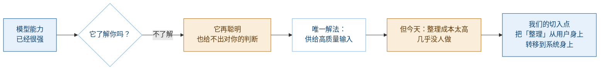

---
tags:
  - 项目/可行动事务Agent
  - 内部筛选
created: 2026-09-23
updated: 2026-09-23
status: 待团队筛选
---

# 可行动事务 Agent · 内部筛选速览

> 给团队做 idea 决策用。读 3 分钟，然后回答文末 3 个问题。
> 完整产品定义见 [[可行动事务Agent-产品定义]]，Demo 规格见 [[可行动事务Agent-Demo状态表]]。

---

## 一、起点判断（先看这一条，其他都是推论）

> **模型的智力和知识量已经不是瓶颈，而且只会越来越强。但它有一个结构性空白——它不了解你。**

它知道所有公开的《国家奖学金评定办法》，但它不知道你的成绩、你的获奖、你想成为什么。

**而这个空白，模型自己永远填不上，只能由用户供给。**

所以真正的瓶颈不是「AI 够不够聪明」，而是「**你喂给它的输入，质量够不够高**」。



**一句话**：我们做的不是「更聪明的 AI」，是**让「你」成为 AI 能用的高质量输入**。

---

## 二、痛点 → 亮点（一一对应）

| #   | 痛点                                        | 我们的亮点                                                             | 为什么别人没解决                                |
| --- | ----------------------------------------- | ----------------------------------------------------------------- | --------------------------------------- |
| 1   | 想让 AI 懂自己，得先花几小时整理文件、建目录、打标签——**成本高到没人做** | **无痛化输入 + 自动沉淀**：丢 PDF / 发微信 / 拍照 / 说一句，系统自己完成识别 → 结构化 → 打标 → 关联  | 现有工具要求用户先整理；我们反过来，**用户不创建标签，结构由 AI 产生** |
| 2   | AI 只会给一段摘要，看完就没了；下次还得重新解释一遍               | **文件 → 可行动事务**：不是摘要，是待办。输出「这是机会还是义务 / 截止几号 / 交到哪 / 要哪些材料 / 你还缺什么」 | 摘要是一次性的；**事务是可以被驱动完成的对象**               |
| 3   | AI 说「你符合条件」，你不敢信；而交材料这事，判错代价很大            | **证据链 + 人工确认**：每条判定可展开到「依据条款 → 我的哪份文件 → 原文片段」；所有外部动作必须用户确认        | 通用 AI 说不清依据；我们把**可追溯**做成准入项，不是加分项       |

**痛点 2 的示例对照**（这是整份方案最直观的一块）：

> 上传《2026 年国家奖学金评定办法》

**普通 AI**：该通知主要包括以下几点……

**本方案**：

```
发现一项可行动事务

【国家奖学金申请】
类型：Opportunity
截止：10 月 XX 日
提交对象：XX 老师
适用对象：本科生（条件判定见证据链）

要求：
  ✓ 成绩排名      来源：《评定办法》第 3 条
  ✓ 综合测评      来源：《评定办法》第 3 条
  ✓ 获奖经历      来源：我的《XX 比赛获奖证书》
  □ 个人事迹材料   来源：—
  □ 申请表        来源：学校模板
  □ 指导老师确认   来源：—

下一步：「整理我的材料包」
```

---

## 三、三个核心亮点（按重要性排序）

### 亮点 1 ｜ 无痛输入：把「沉淀」这件事的成本降到零

用户只负责丢：PDF、Word、微信转发、拍一张通知、粘一段话、以后直接语音说一句。
系统负责：识别 → 提取 → 分类 → 标签 → 建立关联 → 判断是否值得长期留存 → 用户确认。

> 这一条是**所有其他能力的前提**。没有它，后面两条都跑不起来——因为没人会为了用你的产品先去整理文件。

### 亮点 2 ｜ 事务原语：文件进来，出去的是待办

核心不是「理解内容」，而是判定：**这对我来说是一项义务、一项机会，还是仅仅一条知识？**

判定分四态，而不是「有 / 没有」：

| 状态 | 含义 | 例 |
|------|------|-----|
| 已满足 | 有事实有证据，达标 | 排名前 8% ≤ 要求前 10% |
| **冲突** | **有材料但不达标** | 实践证明 12 小时 < 要求 30 小时 |
| 缺失 | 完全没有对应事实 | 无科研成果证明 |
| 待确认 | 无法自动判定，需线下核实 | 违纪记录需教务核实 |

> **「冲突」这一态最值钱**——它证明系统真的在**判断**，不是在匹配关键词。

### 亮点 3 ｜ 证据链 + 人工确认：让判定可以被质疑

每一个「已满足 / 不满足」都能展开到：**条件条款 → 依据第几条 → 我的哪份文件 → 原文片段**。

并且系统**不编写用户不存在的经历**，只整理已有材料；缺来源的内容显式告警，不自动补写。

> 这不只是产品功能，是**这类产品能否成立的前提**——「资格判定」判错的后果，比不提醒严重得多。

---

## 四、竞品对照：我们不是「又一个 AI 知识库」

![[file-20260923225113539.png]]

**关键差异一句话**：Mem / Notion 类产品做的是 **Context understanding**（理解我在做什么）；我们做的是 **Requirement → Person matching**（把某份文件的条款条件，逐条判定到具体个人身上并举证）。

它们不需要做这件事——它们的任务是「跟上你的工作」。这不是功能差距，是**推理类型不同**。

---

## 五、路演答辩：两个场景 Demo

> ⚠️ 分工要明确，否则两个都做不深：**校园场景做「真」，公司场景做「广」。**

| | 校园 Demo（主） | 公司 Demo（辅） |
|---|---|---|
| 做什么 | **第二课堂学分认定**：丢入「培养方案 + 二课认定办法 + 我的已修学时统计」→ 直接算出**还差哪一类、多少学时、该去修哪个** | 教育局通知 → AI 理解 → 判断涉及哪些教师 → 生成任务 → 匹配模板 → 教师提交 → 自动汇总 → 负责人周报 |
| 做到什么程度 | **真实跑通**：真 PDF 真解析、真规则判定、真证据链 | **证明可迁移**：同一套能力换一个场景，不必做到同等深度 |
| 证明什么 | 这件事真的能做出来 | 这件事不只适用于学校 |

### 为什么校园 Demo 选「学分认定」而不是「奖学金」

**它命中的是「总量达标 ≠ 分类达标」——学生最痛、也最看不见的地方。**

二课学分是**双约束**：总量要够，且**每一类都要单独达标、不能互相抵扣**。

> 于是最典型的情况是：总学时 128 / 120，看起来早就够了；但「创新创业」只有 12 学时——**某一类不满，就通不过认定**。

学生在教务系统里看到的是一个总数，**看不出是哪一类不够**。这正是系统能做、人做不到的事。

另外三个附加优势：

| 优势 | 说明 |
|------|------|
| 输出的是**数量缺口**，不是资格判定 | "再修 8 学时就行" 比 "你不合格" 可行动得多，天然导向 Action |
| 判定是**纯数值** | 完全适配「LLM 归一化 + 规则判定」架构，零幻觉风险 |
| **无学术诚信风险** | 系统只做算数与列清单，没有代写成分 |

> 详细规格见 [[可行动事务Agent-学分认定Demo规格]]。奖学金场景不废弃，降为「机会类」的一句话佐证。

### 为什么校园是天然实验场（不是「因为没人做中文校园」）

> **校园场景拥有高度标准化、强规则、强时间节点、强材料要求的文档体系，是验证「Document → 可行动事务 → Workflow」这一能力的天然实验场。**

这些文件天然具备：**对象 / 条件 / 时间 / 材料 / 流程 / 责任人 / 例外情况**——是规则化推理最理想的训练与验证环境。

大学不是壁垒，**是实验场**。

> ❌ 不要说「没人做中文校园文件，所以是壁垒」——评委一句「补个端、换个模型就行」就能化解。

---

## 六、演进路径

| 阶段 | 形态 | 说明 |
|------|------|------|
| 1 · 个人版 | 我的大学事务系统 | 一个人用，沉淀出个人信息 |
| 2 · 团队版 | 团队聚合 Agent | 前提是**每个人都在用、都沉淀出了个人信息**；团队版把这些汇总，针对每个人输出；且**团队成员对汇集 Agent 白盒可视** |
| 3 · 企业版 | Document-driven Workflow | 见上表公司场景 |

**企业侧入口不是「企业 AI 知识库」**（Glean / Notion / 飞书 / M365 已经极强），而是：

> 凡是「收到一份文件 / 通知 → 判断谁需要做什么 → 准备材料 → 执行 → 汇报」的流程，都是市场。

> ⚠️ 企业侧**尚未做过任何真实访谈**，目前是方向假设，不是已验证事实。路演只能说「下一阶段向企业侧延伸」。

---

## 七、明确不做（边界）

❌ 通用文档管理 / 网盘 / 笔记软件　❌ 开放式聊天助手　❌ 关系图谱可视化（藏在后面，不做卖点）　❌ 用户自建标签体系　❌ 全能输入（第一版只做 PDF / Word / 图片 + 文本）　❌ 自动提交外部系统

---

## 八、⛳ 需要团队现在回答的 3 个问题

> 内部筛选就是筛这个。以下三题不定，后面全是白做。

1. **要不要押「事务」这个原语？**
   这是整个方案的支点。如果决定回到「AI 知识库 + 主动提醒」，那 Mem / Notion 已经是成熟产品，我们没有胜算。
   → 我的判断：**必须押**，否则不建议参赛。

2. **72 小时只做一个闭环，砍到哪一刀？**
   我的建议：**1 个场景（奖学金/评优）× 1 种输入（PDF）× 3 分钟讲完**。
   两个 Demo 里，校园做真的，公司做短的。如果有人主张两个都做深——那等于两个都做不完。

3. **企业侧先访谈还是先放着？**
   现在企业侧全是我方推演。要么在赛前找 2–3 个真实的人（老师 / 辅导员 / 行政 / 教育机构）聊 30 分钟，要么路演时明确标注为「方向假设」。

---

## 九、风险提示（团队需共同承担）

| 风险 | 说明 |
|------|------|
| **学术诚信红线** | 「一键生成申请材料」实质是代写个人事迹，校内评审多为高校教师，极易被当场质疑。统一表述为「**整理与校对已有材料 + 列出缺口**」 |
| **差异化窗口短** | Mem 迭代极快，今天的空位可能 6–12 个月被填。护城河要放在「条款级判定 + 举证」，不放存储 |
| **竞品能力必须实测** | 不许凭想象攻击竞品。Mem 已支持 Slack / Gmail 双向同步、WhatsApp、日历、PDF——讲错一句会被当场打回 |

---

返回 [[可行动事务Agent-产品定义]] · [[00-首页|🏠 首页]]
