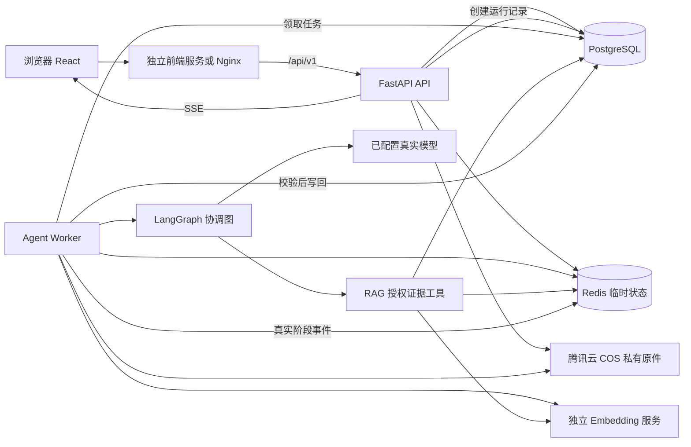
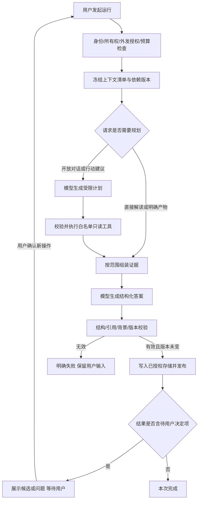

---
tags:
  - 项目/可行动事务Agent
  - 技术设计
  - 智能体
  - 前后端分离
created: 2026-10-02
updated: 2026-10-02
status: 正式个人版技术设计；已确认写入腾讯云COS与RAG方案，产品代码尚未按本稿实施
---

# 可行动事务 Agent · 正式个人版技术开发设计

导航：[[docs/可行动事务Agent-00-总览|文档总览]] · [[docs/01-产品方案/可行动事务Agent-正式个人版架构与交互设计|产品与交互设计]] · [[docs/01-产品方案/可行动事务Agent-个人MVP开发验证|MVP实现证据]]

## 1. 文档效力、目标与范围

### 1.1 已确认要求

2026年10月2日，用户认可已运行的MVP，要求基于高保真原型开发完整正式项目、采用前后端分离，并明确选择个人多账号、登录与用户数据隔离、具备后续部署基础、本次不发布公网。用户随后要求说明智能体设计、重新评估SQLite并补全技术开发设计。

本稿是正式个人版的技术基线建议。数据库采用PostgreSQL，替代上一版“正式版先用SQLite”的建议。产品页面、可选择不保存/不行动、真实模型和隐私边界保持不变。本文中的新增服务、接口、数据库表、性能目标和测试场景均为设计，不是已经实现或通过验收的陈述。

2026年10月2日，用户确认将腾讯云COS和RAG方案写入开发设计：已保留原件存入私有COS，PostgreSQL + pgvector保存长期文本分块与向量；RAG采用受授权范围约束的关键词与向量混合检索，作为单协调Agent的证据工具。临时原件默认不上COS，临时正文及向量不写入长期数据库；COS保存、Embedding外发与生成外发分别记录授权。此次确认是设计落地，不表示云资源已经创建或模型能力已经验证。

本稿优先规定技术合同；产品范围以现行产品与交互设计为准。旧MVP设计和既有验证记录保留历史身份，不倒改当时的实现与测试事实。详细编码任务在本稿确认后拆解，未经授权不提交Git、不迁移用户数据、不公开部署。

### 1.2 完成定义

交付可独立运行的React前端和FastAPI后端，含真实登录、各用户私有文件空间、多文件多轮工作区、可核对引用、可控背景沉淀、用户确认的行动、多版本成果及真实下载。明确保存的数据可跨刷新、重登和服务重启恢复；临时处理无需转为长期保存。

可见功能必须有真实后端行为、完整空态/加载态/错误态和权限校验；原型里的合成人物、预置答案、固定文件数量和虚构进度不进入正式账号。用户只理解、不保留背景、不创建行动也能完成使用。

### 1.3 本期边界

- 文件：TXT、Markdown、文本PDF、DOCX正文与表格；不把原型中的JPG证书视为已支持OCR。图片、扫描PDF、加密文件明确报不支持或无法提取。
- 模型：生成沿用当前受控配置的真实服务，不擅自切换供应商；Embedding单独配置、授权与验证，聊天接口连通不代表Embedding可用。不用模拟答案、缓存回放或规则分支冒充新调用。
- 产物：可编辑Markdown、行动清单、依据与未知摘要；单项Markdown和整包ZIP下载。
- 不含团队共享、企业组织权限、第三方登录、邮件/短信、OCR、日历、支付、自动报名/发信/提交、公网发布。
- 代码和部署配置齐备不代表已完成公网安全、压力或灾备验收；这类结果必须另有真实记录。

## 2. 当前MVP与正式智能体的差异

### 2.1 当前代码真实情况

当前 `backend/fileaction/model.py` 的 `OpenAICompatibleModel` 提供两个模式：无目标时生成 `Reading`；提供目标时生成 `Artifact`。它把单份文件片段、已确认背景和目标发给Chat Completions，使用JSON模式，再做Pydantic校验。`app.py` 校验引用，`sessions.py` 用revision和取消机制阻止迟到结果。

当前没有规划器、工具选择循环、跨多份材料的检索编排、完整多轮消息历史、后台任务恢复或多用户归属。SQLite只保存显式保留的背景；主要文件和结果在进程内存。现有真实模型冒烟证明这一窄流程连通，不能视为下表新增能力已经实现。

| 层面 | 已有MVP | 本稿正式版 |
|---|---|---|
| 模型交互 | 解读、起草两条直接调用 | 协调智能体与显式状态图，按请求选择直达生成或受限规划 |
| 上下文 | 单文件、本次背景 | 经授权的多文件、当前目标、选定背景与有限对话历史 |
| 工具 | 应用代码直接解析与校验 | 有类型合同的只读证据工具，由服务端执行并再次鉴权 |
| 存储 | 无归属背景SQLite；进程会话 | PostgreSQL业务数据与pgvector索引，Redis临时内容，腾讯云COS私有原件 |
| 证据检索 | 单份材料直接组装 | 短材料全文；长材料与多文件走受控RAG，检索后校验原文引用 |
| 行动 | 一份可编辑草稿 | 用户确认的行动记录、多份成果与版本 |
| 长操作 | 当前请求内等待 | 独立Worker、持久任务元数据、SSE真实阶段事件 |
| 访问控制 | 本机、随机会话ID | 账号会话、所有权、CSRF、数据库隔离与限额 |

### 2.2 智能体的职责

智能体负责理解用户意图、选择本次已授权证据中的相关内容、解释与用户的关系、提出必要问题、形成候选沉淀和可选行动/草稿。业务服务负责认证、授权、数据保留、资源所有权、操作预算、版本、任务执行、结果校验和导出。

用户看到一个文启Agent。内部有规划、证据、生成、校验等节点，均围绕同一份运行状态协作；本期不引入多个独立人格互相聊天的机制。采用LangGraph组织有条件的状态图与节点，业务对象及权限保持为独立Python服务，避免将业务规则写死在框架回调中。[S4]

## 3. 技术选型与数据库决策

### 3.1 技术栈

| 层 | 选型 | 本期职责 |
|---|---|---|
| 前端 | React、TypeScript、Vite；沿用现有已安装技术线 | 独立构建，路由、页面、状态、证据交互和编辑 |
| 前端路由与数据 | React Router、TanStack Query | 路由恢复、按账号隔离的请求缓存、失效刷新；新增依赖在实施兼容性检查后锁定 |
| HTTP API | FastAPI、Pydantic、Uvicorn、httpx | 认证、命令、查询、SSE、契约、模型HTTP连接 |
| 智能体 | LangGraph 1.x的Python状态图 | 有界编排、条件分支、节点追踪；不自动外发运行追踪 |
| ORM与迁移 | SQLAlchemy 2.x、psycopg 3.x、Alembic | PostgreSQL访问、事务、迁移与连接池 |
| 主数据库 | PostgreSQL 17系列 | 账号、保留工作区、版本、授权记录、运行元数据和任务队列 |
| RAG检索 | PostgreSQL + pgvector；关键词与向量混合召回 | 长期文本分块及向量；初版授权子集精确检索，近似索引在实测后引入 |
| Embedding | 独立EmbeddingGateway及受控模型配置 | 文本和查询向量化；供应商、模型、维度及批量限制以真实兼容测试确认 |
| 临时状态 | Redis 7.4系列，专用非持久实例 | 临时文件/对话、限流、短期事件与缓存；不是业务事实主库 |
| 原件 | 腾讯云COS私有桶，后端CosBlobStore适配器 | 保存用户明确保留的原文件；本期后端中转上传与下载，不开放公共读写 |
| 密码 | Argon2id | 密码散列与校验；参数见第12节 |
| 测试 | pytest、Vitest、Playwright，真实PostgreSQL/Redis集成 | 领域、合同、所有权、竞态、UI和真实模型分层验证 |

现有依赖精确版本以仓库锁文件为准，本期不为设计稿升级它们。新增依赖选择上表技术线后，须实际安装、检查相互兼容、生成锁定文件和镜像摘要，再记录准确补丁版本；本稿没有将未安装版本写成已验证环境。

新增依赖还包括腾讯云COS Python SDK、pgvector扩展及Python适配库；须验证PostgreSQL版本、实际Embedding维度和查询算子的兼容性后锁定，不把未安装的依赖写成已验证。

### 3.2 为什么改用PostgreSQL

SQLite适合嵌入式、单机和写并发较低的场景；即便WAL允许读写并行，同一数据库文件仍只有一个写入者。不能简单说“SQLite不支持多用户”，但同时写入对话、生成任务、成果版本、登录会话和编辑冲突时，单文件写入与部署方式会成为需要处理的约束。[S1][S2]

PostgreSQL提供MVCC、事务与行级锁，适合本项目把多个API/Worker进程连接到同一业务数据库；它也提供行级安全策略，作为应用所有权校验的第二层约束。[S3][S5] 因此本项目直接用PostgreSQL做正式版主库，避免先扩展SQLite再迁移全部并发和数据归属逻辑。

| 关注点 | SQLite方案 | 正式版PostgreSQL方案 |
|---|---|---|
| 起步成本 | 一个本地文件，最少安装步骤 | 需要数据库服务、用户、备份与迁移管理 |
| 多进程写入 | 围绕单一写入者处理等待和忙错误 | 使用短事务、行级锁及乐观版本控制 |
| API与Worker分离 | 单文件的部署与共享需要额外约束 | 通过连接字符串访问数据库服务 |
| 私有数据隔离 | 主要由应用所有权查询保证 | 应用所有权、组合外键、RLS共同约束 |
| 扩展部署 | 本地单实例更直接 | 便于独立数据库和多应用进程，但仍需实际容量验证 |

PostgreSQL并不自动解决越权、写入冲突或慢查询；后文仍规定所有权、事务、索引、限流和压力测试。Redis的引入理由是临时内容跨API/Worker共享，不是因为PostgreSQL必须搭配Redis。

### 3.3 数据库兼容与旧数据

正式版集成测试使用PostgreSQL，不能用SQLite测试替代其外键、RLS、JSONB、锁和迁移验证。保留原 `var/fileaction.db`，不自动导入、不删除，不默认归属首个注册用户。新数据库使用独立名称 `fileaction`，账号由正式注册或管理员受控创建。

需要导入旧背景时另走受控迁移：指定目标账号、列出待导入内容、用户确认、记录来源、执行幂等导入；本期默认不执行。不会因更换数据库回写现有MVP验证记录。

## 4. 总体架构与进程划分



### 4.1 应用职责

- **前端**：文件空间、工作区、行动、成果、账户页面；API客户端；授权预览；SSE订阅与本地编辑草稿。不能持有模型密钥或直连数据库。
- **API**：验证身份、CSRF、请求大小与所有权；执行业务命令；记录运行授权；提供查询、私有下载和事件转发。生成任务返回202，不长期占用创建请求。
- **Worker**：领取生成、解析与索引任务，按用途检查授权、预算与租约，执行状态图或索引流水线，有条件提交结果。不能凭模型输出提升权限。
- **PostgreSQL + pgvector**：权威业务状态、任务领取、运行元数据、长期分块与向量；数据库事务中不等待生成、Embedding或COS请求。
- **Redis**：有TTL的临时数据和阶段事件。RDB与AOF均关闭，不使用Redis持久化保存用户未授权保留的正文。[S6]
- **CosBlobStore**：按服务端生成对象键访问私有COS；数据库保存对象引用和校验hash，不保存签名URL，不接受用户提交任意桶、对象路径或下载URL。
- **RAG与EmbeddingGateway**：索引任务只处理已授权文本；检索工具只搜索本次Manifest授权范围。Embedding是独立外部调用，不获得领域写权限，也不自动继承生成模型密钥。

### 4.2 部署边界

开发：前端5173、API8000可配置，PostgreSQL5432和Redis6379只允许本机或私有容器网络访问。实际端口须先检查占用，不停止用户已有服务。前端和API可各自启动、停止、构建和验收。

交付结构支持 `web`、`api`、`worker`、`postgres`、`redis` 五个服务。公开环境只暴露HTTPS入口，`/api`反向代理到API；模型凭证仅存在API/Worker受控环境。默认一份API和一份Worker运行，不能把配置允许多实例写成已经压测通过。

COS是本期正式原件后端；桶、地域、最小权限CAM身份、服务端加密及凭证来源须显式配置，不在启动时自动创建云资源。开发部署的五个服务另依赖受控COS和Embedding端点；不发布公网不等于没有云端外发。Redis高可用、数据库主从、Kubernetes、外部队列和单独向量数据库不作为本期启动前提。Docker/psql此前未在当前PATH发现，容器、数据库、COS与Embedding运行结果均待实施时验证。

## 5. 智能体状态图与执行策略

### 5.1 一次运行的合同

运行类型 `interpret | chat | propose_actions | generate_artifact` 由用户请求确定。模型可以建议下一步，不能把解读请求升级成已执行的起草、长期保存或外部操作。

`AgentState`只包含 `run_id`、`owner_id`、工作区引用、修订号、上下文清单ID、节点、计划引用、结果引用、工具次数、模型调用次数、预算和错误码。原文、用户消息、模型正文通过 `RunContentStore` 按保存模式读取，不进入通用日志或未受控checkpoint。



### 5.2 节点职责及调用上限

| 节点 | 是否调用模型 | 输入/输出及限制 |
|---|---|---|
| `authorize_run` | 否 | 身份、工作区版本、授权hash、所选文件与背景；失败直接结束 |
| `freeze_context` | 否 | 生成不可变Manifest，记录文件/背景/目标/历史选择的版本 |
| `plan_request` | 至多1次 | 生成意图、证据需求与最多6项白名单工具请求；不能增加授权资源 |
| `resolve_evidence` | 不调用生成模型；可调用Embedding | 按Manifest执行受控RAG与只读工具，返回带来源的原文；最多6次工具调用，不无限循环 |
| `compose_answer` | 至多1次 | 生成回答、问题、候选沉淀、行动建议或用户已授权的产物 |
| `validate_output` | 否 | JSON结构、来源、引文、背景版本、依赖有效性与输出大小 |
| `commit_result` | 否 | 比较修订与授权后原子写回；版本冲突或取消时丢弃 |
| `publish_event` | 否 | 发布真实节点状态和结果引用，不发布未经校验的结论 |

明确的解读/起草默认1次生成模型调用；需要计划的开放请求最多2次生成模型调用。每次生成请求60秒，运行开始后总上限150秒（不含最多120秒排队），所有阶段服从剩余总预算。Embedding单独计数：每次运行至多1次查询向量化请求、最多6条已授权查询、总计1200字符、15秒超时；兼容测试必须验证批量能力，未通过不得拆成未计数的额外调用。只读工具总共最多6次；本地工具单次2秒，RAG工具含查询向量化最多20秒，解析任务独立20秒。校验失败不自动增加“修复”模型调用，用户明确重试才创建新运行。文件索引是独立任务，有第6.6节规定的批次与费用预算，不挤入这150秒生成运行。

### 5.3 受限计划而非原生Function Calling前提

已接通供应商只验证了JSON模式，未验证原生tool calling。本期将模型计划作为受Pydantic约束的JSON合同，由服务端执行，不依赖供应商原生函数调用能力。计划结构固定如下，未知字段或工具名一律拒绝：

```json
{
  "intent": "explain_relevance",
  "evidence_requests": [
    {
      "tool": "search_evidence",
      "arguments": {
        "query": "申请条件",
        "document_ids": ["synthetic-document-id"],
        "limit": 6
      }
    }
  ],
  "needs_user_input": false,
  "question": null
}
```

示例ID仅说明结构，不是可执行资源。`intent`枚举为 `explain_relevance | answer_question | compare_requirements | clarify | propose_actions | revise_draft`。规划不返回任意代码、SQL、URL或待执行Shell。

### 5.4 工具注册表

| 工具 | 参数合同 | 结果及权限 |
|---|---|---|
| `search_evidence` | `query`最多200字符，`document_ids`为Manifest子集，`limit`1–12 | RAG管线自动读取命中原文，返回片段ID、版本、位置与原文；检索集合为本次授权片段子集 |
| `read_segments` | 至多12个 `(document_id, version, segment_id)` | 精确原文与位置；再次验证所有权和Manifest |
| `inspect_confirmed_facts` | 至多20个 `fact_id`，均在Manifest中 | 已确认内容、来源、版本及适用范围；不查询全用户画像 |
| `read_artifact_version` | 本次所选的 `artifact_id, version` | 作为待修改草稿读取；模型旧稿不自动成为事实证据 |
| `calculate_ratio` | 十进制数值、非零分母、来源引用 | 确定性计算结果及原来源；不执行表达式，不据比例推定资格 |

工具返回内容同样视为数据，不是系统指令。不注册全盘文件访问、任意HTTP、SQL、Shell、发信、报名、共享或删除工具。保存背景、创建行动、修改目标和导出由经过用户确认的领域命令完成，不能从模型计划直接触发。

`search_evidence`内部固定执行“范围过滤 → 混合召回 → 融合去重 → 预算裁剪 → 读取原文”，合计一次工具调用；不要求规划器预先猜测搜索返回的片段ID。`read_segments`仅供明确已知的授权片段调用。服务端汇总本次最多6个检索查询，一次批量向量化，再分发检索；没有Embedding授权或可用索引时不得暗中调用服务，采用第6.2节明确的全文/关键词路径或报告能力不可用。候选为空则输出证据不足，不扩大授权集合。

### 5.5 用户确认与恢复

模型提出问题、候选背景或行动后，该次运行可以正常完成并展示待决定内容；用户回答、选择保留或发起起草是新的显式操作，不保持一个长期占用Worker的等待任务。LangGraph支持人机中断，但框架checkpoint本身不替代应用授权；本期确认以业务对象和版本为准。[S7]

保存授权绑定用户、资源集合、版本及操作目的。用户修改材料、背景或目标后旧授权失效；“刚才已经同意”不能授权新材料外发。对话中的“先不申请”等意图先形成可确认目标变更，确认后才更新目标并使旧方向行动需重新核对。

## 6. 上下文、证据检索与记忆

### 6.1 ContextManifest

每次运行先生成下列清单并让用户可查看：所选文档及版本、允许发送的片段、选中的已确认背景及版本、本次消息与目标、包含的对话轮次、模型服务域名和模型名、提示词版本、操作种类、保存模式、长度与授权hash。默认授权范围是已选短材料的完整文本；长材料的片段范围先由本地检索/用户选择确定，再预览确认，不在首次授权之后悄悄扩展。

Manifest另外记录 `retrieval_mode`、所选索引版本、Embedding服务域名/模型/维度、查询向量化授权ID和查询来源范围。预览阶段不调用外部模型；初次长材料片段选择用本地关键词或用户手动选择。运行中的RAG仅能在已预览授权的片段中进一步筛选。查询可来自本次问题及规划器在授权上下文内生成的有界检索词，界面明确这类派生查询也会发送给Embedding服务；不授权则选全文/关键词模式。

实际各次模型调用可以只发送授权范围的子集，运行记录保存实际用到的资源/片段ID清单。即使某文件已经属于用户，工具也不能读取或外发该文件中未被本次片段模式授权的其他片段；需要扩展范围时结束当前运行并请求新的预览确认。规划器看到的文件名、摘要和背景同样属于Manifest约束范围。

`manifest_hash`由上述内容的规范化JSON及内容hash计算，服务器产生；客户端不能自行声明已授权的文件。授权记录不在日志复制全文。后台根据清单重建请求时必须验证资源仍可用、所有权未变且依赖版本一致。

### 6.2 RAG与混合检索策略

RAG作为单协调Agent的证据工具，完整链路为“解析 → 结构分块 → 授权后向量化 → 索引 → 授权范围内检索 → 原文组装 → 生成 → 引用校验”。短材料满足完整请求预算时优先全文进入上下文；长材料和多文件使用受控RAG，不因启用向量检索而强制短通知只取Top-K。[S16]

初版混合召回由两路组成：中文规范化词面/子串匹配及位置排序；同Embedding配置的余弦距离向量检索。各路候选最多20条，服务端用RRF融合（初始k=60），按片段ID去重并折叠重叠文本，最多返回12条且满足总文本/token预算；不足不补入未授权片段。数值是待评测的初始参数。文件标题/分类搜索仍是本地元数据查询，不调用Embedding；不宣称PostgreSQL默认全文搜索提供中文语义检索。

长期索引使用PostgreSQL + pgvector，初版在 `owner_id + 已选文档版本 + 已授权片段ID + active索引版本 + 未删除状态` 限定集合内做精确向量检索，临时向量从Redis取出后在有界集合内计算。权限过滤在数据库/检索服务中执行，不能全库召回后只靠前端过滤。近似HNSW/IVFFlat索引与独立重排序模型列为后续优化；pgvector近似索引的过滤可能减少返回条数，启用前必须验证带过滤条件的召回率、执行计划和隔离，不能沿用无过滤基准。[S15]

未授权Embedding、索引未完成或Embedding不可用时，用户可明确选择全文/关键词模式；记录 `retrieval_mode=full_text|keyword|hybrid` 和缺失原因，不静默把关键词结果称为向量RAG。已选hybrid的运行遇到错误明确失败，不临时改变模式。`coverage=full_selected_text|selected_excerpts`由实际送入生成模型的片段覆盖计算，模型不得自行夸大；即使索引覆盖全文，Top-K答案也不能宣称完整审查。比较矛盾材料时保留不同来源和冲突，不按分数择一认定事实。无证据时输出未知或提问。

每次检索记录所用索引版本、授权过滤范围hash、查询内容引用、候选及最终片段ID、各路排名和预算裁剪原因；临时查询正文和检索原文仅在Redis。索引更新、来源删除或版本改变时再次校验依赖，旧候选不能绕过运行提交校验。一个检索块映射多个原文片段时，只有其全部原文范围都在Manifest内才进入候选；不能读取跨越授权边界的整块，再用输出裁剪掩盖越界。明确问题直接作为查询，开放解读使用本次已授权目标或固定通用检索词；查询正文和派生检索词均纳入查询Embedding授权。

### 6.3 输入与输出预算

| 对象 | 初始硬限制 | 超限行为 |
|---|---|---|
| 单文件 | 10 MiB、提取40,000字符、PDF50页 | 拒绝并提示缩小范围；不截断冒充完整读取 |
| 工作区关联 | 最多20份文件 | 阻止新增，提示拆分工作区 |
| 单次模型文件文本 | 总计40,000字符 | 用户缩小文件集合或明确选择片段模式 |
| 本次背景 | 最多20条，总计8,000字符 | 提示只选择相关条目 |
| 历史消息 | 最多12条，总计12,000字符 | 明确显示未纳入范围；允许用户选择不同历史 |
| 本次用户输入 | 4,000字符 | 前后端一致拒绝 |
| 完整请求 | 估算不超过已配置输入token预算，默认16,000 | 估算仅用于限制，不作费用报告；超限阻止发送 |
| 模型输出 | 默认4,000 token；单产物正文最多30,000字符 | 截断或超过结构限制明确失败 |

字符上限与token预算同时满足。供应商支持的具体输出token参数须通过适配器能力测试，不能假设所有服务接受同一参数；未确认能力时仍执行请求字符和响应字节上限，且明确不能据此保证供应商计费上限。

### 6.4 三类记忆与保留

1. **运行上下文**：一次调用需要的材料与指令，不自行持久保存。
2. **工作区内容**：当前文件选择、对话、解读、目标和草稿；默认临时，用户选择保留后才进入长期业务库。
3. **个人保留背景**：用户明确确认并另行授权保留的事实，带来源、版本和可选适用期；每次复用由用户选择。

不把系统推断、未知、行动建议、模型摘要或临时目标自动写入长期背景。候选背景先编辑/确认用于本次，保留是第二个选择。事实撤销、来源删除、版本更新和适用期届满都会使关联结果需重新核对。事实旧版本不能继续作为当前证据发送。

### 6.5 提示词与模型能力

提示词按 `planner`、`interpreter`、`conversation`、`action_proposer`、`artifact_writer` 版本化，放在后端源码。系统策略、输出Schema、来源数据分开组装；不将文件内容拼进可覆盖系统角色的位置。运行记录保存提示词版本及内容hash，不默认保存完整Prompt。

适配器暴露 `json_mode`、`native_tool_calling`、`streaming`、`vision` 和输出预算参数能力。当前仅按已验证JSON模式设计，其他能力默认关闭。切换能力先跑合成兼容测试，不通过时显示能力不可用，不静默换模型。

### 6.6 分块、Embedding与索引生命周期

以解析器产生的不可变原文片段为引用基准，再按标题、段落、条款和表格边界生成检索块；初始目标500–800中文字符、硬上限1200字符、同一结构内最多100字符重叠。不拼接不同文件或版本，不破坏否定条款与表格行含义；大结构拆分时保留标题/表头为检索辅助字段，辅助文字不能作为原文引文。检索块通过 `chunk_segments` 映射到原片段及字符起止位置；每文件最多256块，超限明确要求缩小范围。分块参数须在合成案例上评测后调整。[S16]

每个索引快照记录文档版本、解析器/分块策略版本、Embedding提供商和模型标识、维度、距离度量、配置版本及块内容hash。文本向量与问题向量必须使用兼容的同一配置，校验维度、有限数值和返回条数；不能混查不同维度或模型空间。模型名和维度不在设计中猜定，以独立真实兼容测试后锁定的配置为准。初版只有一个活动Embedding配置；pgvector向量列的维度约束由显式迁移绑定该配置，不能依据用户请求动态DDL。改变模型或维度走新索引构建、覆盖和召回验证、原子切换活动指针，旧索引退出检索后清理；维度改变另做新表/列迁移。

索引状态独立于解析状态：`not_requested → queued → embedding → ready | failed | cancelled`，来源变更后旧索引`stale`，删除后`deleted`。解析ready只表示能读原文，不等于可以语义检索。构建新索引不原地覆盖旧快照，只在全部块成功并复核授权、文件版本和删除状态后发布；不得把部分成功标成ready。

索引由独立Worker任务执行：每次外部请求最多32块且满足供应商单条/批量token限制；每文件最多16个请求、单请求30秒、活动执行总计300秒，超过任一预算则失败或要求缩小输入。调用前记录批次hash、索引版本、授权ID和费用状态；响应按明确返回序号或适配器已验证顺序映射块hash，不能猜测顺序。已发出但响应不确定的批次不自动重发；显式重试复用已完成块，只补缺失块并提示可能费用。账号最多1个活动索引任务、全局2个，与生成运行的4个并发限额分开统计。配额和请求次数包括失败请求。

长期文件只有获得索引外发授权后才生成长期向量；临时文件如用户选择语义检索，也须先独立授权，块及向量仅在Redis，继承会话、60分钟闲置和24小时硬期限，受内存字节配额约束，不写入pgvector。临时原件仍不上COS。临时工作区保留时，索引是否长期保存须列入保存预览，保留相同配置和hash的向量无需再次外发；未选择保留索引则只保存已同意的内容，后续重新向量化仍须授权。

删除文件或账号时，先撤销读取/检索资格并取消任务，再清理相应分块、向量、查询缓存及COS对象；只撤销索引时保留原文片段和COS原件，清理该索引的分块、向量及缓存。迟到Embedding响应不能复活索引。索引故障不删除原文件，允许读取/下载或明确改选非向量路径。向量、问题和检索结果按用户资料管理，不视为可公开的匿名技术数据。

### 6.7 云存储、索引与生成的独立授权

| 用途 | 告知与绑定范围 | 不代表同意 |
|---|---|---|
| `store_original_cos` | COS地域、文件版本/字节hash、保存期限、原件范围 | 将全文发送给Embedding或生成模型 |
| `embed_document` | 提供商域名、模型/配置版本、块集合hash、用途、临时/长期模式及预算 | 生成回答、长期保留临时文件 |
| `embed_query` | 问题及授权上下文派生检索词的范围、服务域名、模型、单次运行预算 | 搜索其他文件或背景 |
| `generate_answer` | 生成模型、当前Manifest、操作种类与保存模式 | 自动保留背景、创建行动或执行外部提交 |

前端可在同一清晰界面展示各用途，复用已明确授权的相同索引快照，不要求无意义重复弹窗；后端分别记录。新增文件、模型/提供商/用途变化、范围扩大均重新授权。用户可拒绝索引外发而保留文件，也可只处理临时文件并结束。现有 `.env` 的聊天模型配置不自动继承为Embedding配置，未配置时显示能力不可用。

## 7. 模型输出合同与校验

### 7.1 AnswerEnvelope

公共结构含 `summary`、`claims[]`、`questions[]`、`memory_candidates[]`、`action_candidates[]`、`unknowns[]`、`coverage`。生成产物运行额外包含 `artifact`；非生成运行不得偷偷产生已入库产物。

```json
{
  "summary": "合成通知给出了截止时间，但申请资格尚需核实。",
  "claims": [
    {
      "id": "c1",
      "text": "报名截止为2026年10月15日。",
      "kind": "document_fact",
      "evidence": [
        {
          "type": "document",
          "document_id": "synthetic-document-id",
          "version": 1,
          "segment_id": "synthetic-segment-id",
          "quote": "报名截止为2026年10月15日。"
        }
      ]
    }
  ],
  "questions": [],
  "memory_candidates": [],
  "action_candidates": [],
  "unknowns": ["资格要求没有在合成通知中列明。"],
  "coverage": "full_selected_text",
  "artifact": null
}
```

该示例仅用于合同说明，不作为生产结果。事实类型固定为 `document_fact | user_fact | inference | unknown`。`EvidenceRef`为文档引用或 `{type: "fact", fact_id, version}` 的判别联合类型，不使用一段自由字符串替代来源。

### 7.2 确定性校验顺序

1. HTTP成功、非拒绝、未截断；响应不超过1 MiB。
2. JSON可解析；严格Schema禁止额外字段、空白正文、未知枚举和过多元素。
3. 文档/片段/背景属于当前用户且在Manifest中，版本未变。
4. 引文是对应片段的原样非空子串；服务端计算字符位置，不相信模型给出的偏移或页码。
5. `document_fact`至少有文档依据，`user_fact`至少有已确认背景依据，`inference`至少有有效依据；未知可无引文。
6. 候选沉淀和行动建议只含当前来源；事实与推断不混写为已确认状态。
7. 重新比较工作区revision、取消标记、账号会话和资源删除状态。
8. 全部通过后写回，否则保留用户输入并返回稳定错误码。

结构和子串校验只能保证来源可定位，不能证明推理正确。语义错误、文档注入、过度推断和不恰当行动建议由专门评测与用户核对覆盖，不能宣称零幻觉。

### 7.3 修改与历史结果

模型初稿与用户编辑版本分开存储。编辑正文可导出，但必须标识用户编辑，原引文仅描述原始生成依据，不能声称已自动核验全部改写文字。来源改变后结果标为 `stale`；旧稿仍可作为历史查看，默认不纳入当前成果包。

历史导出使用单独明确操作，强制带“历史/依赖已变化”标识和原生成时间；不能通过简单勾选将过期版本重新变成“模型已校验”。重新生成才能得到新依赖下的模型结果。

## 8. 数据生命周期与文件存储

### 8.1 保存模式

| 数据 | 默认位置 | 长期保存条件 | 删除/到期 |
|---|---|---|---|
| 账号、登录会话、安全元数据 | PostgreSQL | 注册/登录所必需，注册时说明 | 会话到期撤销，账号处理走明确账户操作 |
| 临时原文件、解析文本、检索块/向量、工作区和草稿 | Redis内存，禁止RDB/AOF；原件不上COS、向量不入长期pgvector | 无长期保留 | 60分钟闲置；临时工作区硬上限24小时；退出、明确结束时删除 |
| 保存文件、解析片段与已授权索引 | COS私有原件；PostgreSQL片段及pgvector向量 | 原件云存储、索引外发及保留分别授权 | 删除先撤销读取/检索，再清COS对象版本、片段和向量 |
| 保存工作区、对话与成果 | PostgreSQL | 明确确认保留范围 | 单独删除确认；结束本次不删除此前保留 |
| 保留背景 | PostgreSQL | 已确认事实 + 单独保留授权 | 可编辑、停用、删除；关联结果失效 |
| 运行、模型调用、错误码等技术元数据 | PostgreSQL | 服务必要记录，不含临时正文 | 未被保留结果引用的终态记录7天后清理 |
| 阶段事件缓存 | Redis | 服务必要状态，无原文 | 终态后1小时或资源删除 |

Redis是临时共享内存存储，不能把“没有写入PostgreSQL”当成完全未存储。UI说明会在服务内存暂存并按期限清除；部署还须考虑交换空间、核心转储和运维备份，不能声称不存在任何系统层残留。

临时资源使用 `tmp:{owner_id}:{workspace_id}:...` 键，由服务端构造。Redis设置认证、私有网络、`maxmemory-policy noeviction`，容量不足明确503/配额错误，不静默淘汰正在使用的资料。API和Worker对临时资源的写入均更新闲置TTL，但不突破硬期限。

### 8.2 上传、解析与索引流程

1. 校验登录、CSRF、保存模式、云存储告知版本、账户限额、文件名和Content-Length；继续流式检查实际字节数。临时上传不要求COS授权；retained上传必须明确同意COS保存及地域。
2. 本期由后端中转上传。临时上传在有界内存接收，原始字节暂存Redis；已保留上传先建立不可见的上传记录与唯一COS对象键，再流式写入私有COS，禁止框架未经配置将临时上传自动溢写到磁盘。记录提供商返回的对象版本ID（若启用版本控制）、长度及应用计算的SHA-256；不把ETag无条件当作内容SHA-256。
3. 去重仅限当前用户，不通过响应泄露他人的同名或同内容文件。解析任务使用受控子进程、输入流及内存预算，最多20秒，检查页数、文本长度、压缩包展开预算和格式错误。DOCX读取正文及表格，不执行宏或外部关系。
4. 生成稳定原文片段ID、定位和文本hash；解析成功后短事务提交对应版本、片段与COS引用，才标为parse_status=ready。COS上传与数据库不是原子事务，未提交对象按任务记录补偿清理；数据库事务不跨COS请求。
5. 生成候选分块和索引预览，不自动调用Embedding。用户确认索引外发范围后创建独立索引任务；成功后index_status=ready，失败保留解析结果并显示原因，不伪造向量。短材料全文解读不依赖索引ready。

解析状态为 `uploading → parsing → ready | failed`，删除进入 `deleting → deleted`；索引状态另按第6.6节维护。文件数、存储和索引额度在开始时原子预留，失败释放未实际占用额度，已保存原件仍计入实际容量。索引失败不自动删除已授权原件。

### 8.3 腾讯云COS与BlobStore合同

COS使用显式配置地域的私有桶，禁止公共读写和匿名列举；服务身份仅授权业务桶/前缀及必需操作，不使用主账号长期密钥。凭证来自后端受控配置或临时身份，启用HTTPS和配置的服务端加密；密钥、临时令牌、签名URL不进入前端构建、Git或日志。COS权限不是应用用户隔离的替代品，所有访问先经业务所有权与删除状态校验。[S13]

BlobStore接口为 `put(actor, object_id, stream, expected_sha256) -> ObjectRef`、`read_range(actor, object_ref, range)`、`delete_version(actor, object_ref)`、`head(actor, object_ref)`。ObjectRef由服务器保存bucket标识、key、可空version_id、sha256和size_bytes；客户端仅传业务文档ID。对象键形如 `originals/{owner_uuid}/{document_uuid}/{version_uuid}`，不含原始文件名；每个业务版本独立对象键，不覆盖原件。写入键在外部请求前记录，Worker可核对不确定的上传结果；COS中不可见批次是应用可见性状态，不依赖磁盘rename或对象“移动”事务。

本期上传、预览与下载经后端代理，支持有界流式传输和经校验的Range请求；每次访问实时检查会话与资源状态。浏览器直传和预签名下载仅保留扩展接口，默认关闭。未来启用时，后端鉴权后才签发指定对象/版本、指定方法、至多60秒的链接；预签名是持有者凭证，登出不会自动撤销已签发URL，必须在产品说明和威胁模型中保留这一有效期边界。[S17]

原件响应设置正确MIME、`X-Content-Type-Options: nosniff` 和私有禁缓存策略；下载名清理控制字符，文本按纯文本显示；PDF预览不执行嵌入脚本，DOCX不声称像素级Word渲染。Markdown/ZIP默认流式生成下载，不自动把导出包再上传COS；以后增加云端导出保存须另行确认期限和清理范围。

若桶开启版本控制，普通删除可能仅创建删除标记、历史版本仍存在；本服务记录并精确删除它管理的所有对象版本及删除标记，完成核对后才报告物理删除完成，不枚举或删除未知业务前缀。保留策略、复制或对象锁若阻止清除，状态保持删除处理中并明确原因；不能把生命周期规则视为即时删除保证。生命周期清理仅作为孤儿上传和过期备份的兜底，具体规则在真实桶验收。[S14]

### 8.4 保留临时工作区的事务

保留请求包含当前revision、拟保存文件集合、工作区内容范围、是否保留分块/向量及确认hash；涉及原件时展示COS地域和云存储用途。服务器冻结明确的消息ID、答案ID、成果版本和文件/索引hash，建立不可见的retaining批次；先将获授权的临时原件写入私有COS唯一对象键，再短事务提交数据库引用及已同意的文本/向量，批次转ready后才出现在文件与历史列表。保存只复制预览快照；预览后新增消息不能因workspace.revision未变而自动纳入。

COS与数据库不是一个原子事务，因此失败必须补偿：未提交对象进入精确对象版本清理列表，数据库回滚，不修改临时副本；用户可在TTL内重试。幂等键绑定同一批次，重复确认不创建重复对象；每次COS写入前记录目标键，崩溃后通过hash和版本核对，不盲目反复上传。最后比较revision及快照hash，变化则返回409，不保存用户未确认的范围。

保留时沿用服务器先前分配的资源UUID，在同一提交批次建立长期对象与版本、补齐历史运行的文档/事实依赖，将 `temporary_ref` 切换为 `workspace_id` 并更新内容引用。已同意保留索引时一并迁移其快照、块映射及向量；未同意保留索引时只保留允许的运行技术溯源标识，不借运行外键持久化临时向量或查询正文。只有授权范围和内容hash完全一致才允许迁移，不能仅保存正文却遗漏引用或模型运行来源；提交成功后再删除对应临时副本。

### 8.5 删除与依赖

删除接口先提供影响预览：哪些工作区、回答、背景、成果和索引会失效。用户确认后，在事务中标记删除、撤销读取与检索、提升相关revision并取消生成/索引任务；异步删除COS精确对象版本、文本分块、向量和相关缓存。任一物理清理未完成时显示“删除处理中”，重试只针对本服务管理的精确对象引用；迟到解析或Embedding结果不得重新发布。

删除来源时同步去除存储在相关结果中的原样引用摘录与预览缓存，保留“来源已删除”的标记。用户已经保存的独立编辑成果不被无提示整份删除，删除预览必须说明其中可能保留用户复制/改写的内容；如需一并删除，由用户选择。所有导出副本与模型服务侧内容均不承诺撤回。

已保留的解读、事实和成果可能含有用户复制或模型归纳的衍生内容，不等同于原文件本体。删除影响预览必须列出这些关联内容，并提供一并删除的选择；不能只清理引文便宣称所有衍生个人信息已删除。

## 9. PostgreSQL数据模型、约束与索引

### 9.1 公共约定

- 主键使用服务端生成的UUID；业务表含 `owner_id UUID NOT NULL`、`created_at TIMESTAMPTZ`，可变资源含 `updated_at` 和 `revision BIGINT`。
- 时间以UTC存储，API返回带时区ISO 8601；前端按用户时区展示，默认Asia/Shanghai。截止时间缺少时区时询问或标为未知，不擅自补造。
- 表含 `UNIQUE(owner_id, id)`；属于同一用户的资源关联使用组合外键，防止混入他人ID。复合外键不能用一条普通ID外键加前端过滤替代。
- 版本号从1递增；版本内容不可原地覆盖。JSONB用于结构化答案、定位和有界元数据，不代替所有权、状态及关键外键。
- 数据库使用CHECK约束状态枚举、非负数量和长度底线；Pydantic负责更丰富输入校验，领域服务负责跨表规则。

### 9.2 表目录

下表省略公共时间及所有权字段；`users`以自身ID作为用户身份，`auth_sessions`使用 `user_id`。临时正文不写入这些长期业务表。

| 表 | 关键列 | 约束、索引与用途 |
|---|---|---|
| `users` | `id, username_normalized, display_name, password_hash, disabled_at` | 用户名唯一；不存明文密码 |
| `auth_sessions` | `id, user_id, token_hash, csrf_hash, expires_at, last_seen_at, revoked_at` | token_hash唯一；用户/到期索引；不存原始会话令牌 |
| `documents` | `id, name, category, current_version, parse_status, deletion_state` | owner+更新时间索引；分类由用户确认，默认未分类 |
| `document_versions` | `id, document_id, version, sha256, size_bytes, mime_type, blob_key, cos_version_id?, extracted_chars, parse_warnings, active_index_id?` | owner+document+version唯一；bucket由受控存储配置映射；保存后原文不可变 |
| `document_segments` | `id, document_version_id, ordinal, locator_json, text, text_hash, char_count` | owner+版本+序号唯一；定位由解析器产生 |
| `document_indexes` | `id, document_version_id, index_version, parser_version, chunker_version, embedding_profile_id, status, consent_id, content_hash` | owner+文档版本+索引版本唯一；ready后才切活动指针 |
| `document_chunks` | `id, index_id, ordinal, text, text_hash, char_count` | owner+index+ordinal唯一；最多256块/文件；仅已授权保留内容 |
| `chunk_segments` | `chunk_id, index_id, document_version_id, segment_id, char_start, char_end` | 组合外键保证同owner、同文档版本；原文偏移与检索辅助文字分离 |
| `chunk_embeddings` | `chunk_id, index_id, embedding_profile_id, embedding, text_hash` | owner+chunk唯一；向量维度受显式迁移约束；RLS及owner/索引过滤 |
| `embedding_profiles` | `id, provider_alias, model, dimensions, distance_metric, config_revision, active` | 系统级不含密钥配置；普通用户只读公开能力，不可修改 |
| `index_jobs` | `id, document_version_id?, temporary_ref?, index_ref, consent_id, status, idempotency_key, request_hash, lease_owner, lease_epoch, lease_until, error_code` | 长期/临时目标恰选一种；owner+幂等键唯一；索引预算与租约约束 |
| `embedding_calls` | `id, index_job_id?, run_id?, batch_no, request_hash, content_ref, response_ref, state, usage_json` | 恰有一种任务归属；prepared/sent/received/committed账本，正文按保存模式分流 |
| `run_retrievals` | `run_id, step_no, mode, index_refs, scope_hash, query_ref, result_ref` | owner+run+step唯一；引用包含候选排名及实际片段ID，不在元数据复制正文 |
| `workspaces` | `id, title, goal, revision, status, retained_at, last_activity_at` | owner+更新时间索引；状态active/paused/ended |
| `workspace_documents` | `workspace_id, document_version_id, position, selected` | owner+工作区+版本唯一；两端组合外键 |
| `messages` | `id, workspace_id, sequence, role, text, answer_id, supersedes_id` | 工作区内sequence唯一；用户消息存文本，助手消息引用结构化答案；更正追加记录 |
| `context_facts` | `id, workspace_id, current_version, active` | 本次确认背景，不意味着保留供以后使用 |
| `fact_versions` | `id, fact_id, version, text, origin_kind, confirmed_at, provenance_state` | owner+fact+version唯一；origin为user_confirmed或document_confirmed |
| `fact_evidence` | `fact_version_id, document_version_id, segment_id` | 组合外键；用户直接陈述可无文件依据 |
| `memories` | `id, current_version, active, valid_from, valid_until` | owner+active索引；过期不允许默认为当前背景 |
| `memory_versions` | `id, memory_id, version, text, source_fact_version_id, provenance_state` | owner+memory+version唯一；内容编辑追加新版本 |
| `workspace_memories` | `workspace_id, memory_version_id, confirmed_at` | 显式选择复用；绑定版本，不自动升级到新版 |
| `answers` | `id, workspace_id, run_id, envelope_json, validity, generated_at` | run_id唯一；validity为current/stale/source_deleted |
| `actions` | `id, workspace_id, title, description, status, priority, due_at, proposal_key, revision` | owner+workspace+proposal_key唯一（非空时）；状态和用户确认时间 |
| `action_sources` | `action_id, answer_id, claim_id` | 关联已确认建议的依据；无来源的用户手工行动标为用户创建 |
| `artifacts` | `id, workspace_id, kind, title, current_version, revision` | owner+workspace+更新时间索引 |
| `artifact_versions` | `id, artifact_id, version, body, body_hash, author_kind, run_id, validity, edited_at` | owner+artifact+version唯一；author为model/user；旧版本不可覆盖 |
| `runs` | `id, workspace_id?, temporary_ref?, auth_session_id, kind, status, manifest_hash, expected_revision, idempotency_key, lease_owner, lease_until, error_code` | workspace_id与temporary_ref恰有一个；owner+幂等键唯一；状态/创建时间索引 |
| `run_manifests` | `run_id, header_json, content_ref, prompt_version, retention_mode` | header只含ID/hash/版本/预算；临时消息和目标正文仅由Redis引用 |
| `run_documents` | `run_id, document_version_id` | 保存运行的文档依赖；两端owner组合外键 |
| `run_facts` | `run_id, fact_version_id?, memory_version_id?` | 恰有一种来源；版本不随当前事实编辑而漂移 |
| `run_events` | `run_id, seq, type, phase, occurred_at, safe_payload` | run+seq唯一；只存阶段/错误码/结果ID，不存原文 |
| `model_calls` | `run_id, call_no, state, request_fingerprint, response_ref, usage_json, started_at, finished_at` | run+call_no唯一；用于防重复费用及崩溃判定 |
| `consents` | `id, operation, manifest_hash, resource_revision, retention_mode, confirmed_at` | 继承owner_id；外发/保存/导出目的分开；不存正文 |
| `retention_batches` | `id, owner_id, workspace_ref, expected_revision, state, idempotency_key` | 保留临时内容的提交与补偿记录 |
| `blob_cleanup_jobs` | `id, owner_id, exact_blob_key, cos_version_id?, reason, status, attempts` | 内部Worker消费；仅服务受管对象版本，不允许任意桶/路径 |

新索引表、分块表、向量表及任务/检索记录同样执行owner组合外键与RLS；分块到片段的关联须约束同一文档版本，不仅同一用户。初版检索按owner、文档/索引版本和授权片段过滤后计算距离。临时索引、块与向量只在Redis，PG的index_jobs/embedding_calls仅保存技术引用和hash；不可为满足外键创建长期正文记录。

临时运行的文档和背景依赖清单位于Redis，`runs`仅保存技术引用和hash；不能为满足外键把临时正文偷偷写入长期表。长期运行依赖使用 `run_documents/run_facts`，它们也是更新来源时查询受影响结果的索引。

历史引用与删除的组合策略：版本默认不可变，但隐私删除允许将正文、原名、定位摘录、blob_key等内容字段置空并写入 `redacted_at`；仅保留ID/归属/版本/删除状态的墓碑，使已有组合外键仍可解释为“来源已删除”。相应内容字段允许在redacted_at非空时为空，CHECK保证正常版本不缺正文。没有任何引用的墓碑可以随后物理清理；不能为删除一个文件无条件级联删除用户独立保存的所有成果。

### 9.3 组合外键与RLS示意

以下是目标约束示意，不是已经执行的数据库迁移：

```sql
ALTER TABLE workspaces ADD CONSTRAINT workspace_owner_key UNIQUE (owner_id, id);
ALTER TABLE artifacts ADD CONSTRAINT artifact_workspace_owner_fk
  FOREIGN KEY (owner_id, workspace_id) REFERENCES workspaces (owner_id, id);

ALTER TABLE artifacts ENABLE ROW LEVEL SECURITY;
ALTER TABLE artifacts FORCE ROW LEVEL SECURITY;
CREATE POLICY artifact_owner_policy ON artifacts
  USING (owner_id = NULLIF(current_setting('app.user_id', true), '')::uuid)
  WITH CHECK (owner_id = NULLIF(current_setting('app.user_id', true), '')::uuid);
```

每个用户数据事务以参数化 `set_config('app.user_id', :authenticated_user_id, true)` 设置事务局部身份，值来自已验证会话，不能来自请求中的owner字段。连接池复用时不得使用跨事务会遗留的会话级设置。

运行角色无超级用户和BYPASSRLS权限，且不是业务表所有者；迁移角色与运行角色分离。PostgreSQL表所有者通常可绕过RLS，因此必须结合FORCE策略与角色划分，不能只创建策略就声称隔离完成。[S5]

鉴权服务需要按用户名查询密码摘要，使用只允许账户认证查询的受限角色/函数；任务领取使用只访问运行元数据的dispatcher角色，领取后以任务所有者身份进入业务事务。若使用SECURITY DEFINER函数，固定search_path、参数化、撤销PUBLIC执行权，单独测试授权边界。

### 9.4 事务规则

每个请求/后台任务使用独立SQLAlchemy Session；不跨并发任务共享AsyncSession。[S9] 模型HTTP、文件解析和大文件读写不放在数据库事务中。

更新可变对象使用条件更新：`WHERE owner_id=:owner AND id=:id AND revision=:expected`，成功后revision加1；零行表示冲突或不存在，按鉴权结果返回409或404。创建版本、更新当前版本指针及发布终态事件在同一事务内完成。

写回答案前锁定当前工作区和运行记录，重新核对所有权、revision、取消、依赖有效性和授权hash；只有一个提交者能成功。数据完整性约束异常转成安全业务错误，不向客户端展示SQL、表结构或他人资源是否存在。

`workspaces.revision`标识文件选择、目标、背景、生命周期和可变属性的修订；消息追加使用独立sequence。追加消息本身不改写已冻结Manifest里的历史消息ID集合，已有消息不可原地修改。接受运行后可记录本次已授权用户消息，提交模型结果时原子追加助手消息与答案；不在写回复时偷偷确认事实或改变目标。

临时工作区没有PostgreSQL正文行，采用Redis原子比较和写回：同时检查owner、登录会话、revision、活动run及取消代次，再写结果与提交标记。随后条件更新PG运行终态并发布事件。若中途崩溃，只根据同一run的已校验提交标记协调元数据，不能重发模型调用；只有PG终态与Redis当前有效结果一致才向客户端报告成功。取消先撤销PG运行的提交资格，再更新Redis代次，避免跨存储间隙把旧结果发布出去。

### 9.5 查询、分页与容量基线

列表默认20条，最大100条；按 `(updated_at, id)` 游标分页，游标签名并限定账号/过滤条件。所有列表索引以owner_id开头；工作区关联、引用回查和运行事件使用组合索引。

初始账户上限：200份保存文件、COS原件总计500 MiB、100个保存工作区；临时原件总计20 MiB，临时派生内容（文本、向量、对话及结果）总计32 MiB，最多2个同时上传；长期索引最多50,000块/账号，每文件256块，向量字节配额按锁定维度计算并在配置中明确。限制集中配置、原子预留；达到上限允许读取与删除，不允许继续写入绕过。该容量是设计限额，不是已压测容量。

## 10. 后台任务、幂等、取消与事件流

### 10.1 队列与状态

本期用PostgreSQL运行表作为生成队列，不另引入Celery/RabbitMQ。Worker通过短事务 `FOR UPDATE SKIP LOCKED` 领取队列记录并设置租约；这是队列式消费用途，不用于需要一致完整结果的普通列表查询。[S8]

运行状态：`queued → running → succeeded | failed | cancelled | stale | interrupted`。Redis临时资源消失时为 `failed`，错误码 `TEMPORARY_CONTENT_EXPIRED`。模型费用状态不确定时为 `interrupted`，不假装失败请求肯定未计费。

每个工作区最多一个活动生成；每账号最多2个、全实例合计最多4个生成运行。限额由数据库租约/锁保证，不用每进程各自的计数器冒充全局限制。Worker租约30秒，每10秒续租；生成队列等待上限120秒，运行上限150秒。

解析任务与索引任务使用独立任务类型/记录，沿用PG领取、租约代次和取消协议；索引快照状态及预算见第6.6节。index_jobs采用queued/running/succeeded/failed/cancelled/stale/interrupted任务状态；费用不确定时任务interrupted、未完成索引failed，不发布部分向量。P0建立最小Worker领取与状态查询骨架，P2接解析/COS清理，P3接索引，P4补全生成SSE及恢复验收，避免前期接口依赖尚不存在的后台执行器。索引任务默认排队上限300秒，超时返回可重试状态，不自动延长授权内容期限。

### 10.2 请求幂等与费用

创建运行要求 `Idempotency-Key`。唯一范围为 `(owner_id, key)`，同时记录规范化请求hash；相同key与相同请求返回同一个run，不再次调用模型；相同key不同请求返回409 `IDEMPOTENCY_CONFLICT`。元数据至少保留24小时，引用它的保留结果仍存在时不得先删除依赖记录。

每次模型调用在发出前记录 `model_calls`：`prepared → sent → received → committed`。请求已发出却没有持久确认响应时，崩溃恢复标为 `interrupted`；不自动重发。用户明确重试时新建run，并说明上次调用可能已经计费。

已完成同一run的响应可用于幂等查询或恢复校验阶段，UI显示原运行时间，不能显示成新生成。没有跨新请求的答案回放机制。本方案不承诺外部模型调用严格exactly-once，只保证本地结果不会重复提交，并避免已知的自动重复付费。

Embedding调用使用独立embedding_calls账本及用量，不能混入“最多两次生成调用”的统计。索引批次重试与查询向量化均遵守sent后不确定时不自动重发；供应商未提供费用信息则记unknown，不据向量数量猜测费用。

### 10.3 取消与修改依赖

取消请求先原子标记运行、提升必要revision，再通知Worker终止可终止的HTTP连接。Worker在每个节点前后检查取消和租约；提交前再次检查。外部服务可能继续计算或计费，产品仅确认本次结果不再应用。

工作区切换只改变当前展示，不删除其他工作区；请求回调按workspace_id/run_id匹配，不回填到新页面。修改目标、材料集合或背景则提升目标工作区revision并使相关在途结果stale。API重启不丢失保留数据；临时Redis丢失则明确提示临时内容已过期。

### 10.4 LangGraph状态与checkpoint

业务资源和运行账本是权威状态。图状态只含ID、版本、节点和内容引用；不能把整个请求对象、文件原文或完整对话传给自动checkpoint。初版使用单次运行内存checkpoint，跨进程恢复依据PostgreSQL节点记录和 `RunContentStore` 重建，不依赖内存checkpointer实现持久恢复。

恢复只自动重做未产生外部付费副作用的确定性节点；模型节点按调用账本判断。未来启用PostgreSQL checkpointer时仍须通过这套账本和授权网关，checkpoint线程命名空间不是访问控制。默认关闭LangSmith/外部遥测和包含Prompt的追踪上传。

### 10.5 SSE事件合同

API提供 `GET /api/v1/runs/{id}/events`，每次连接和重连都鉴权。事件有递增seq，可用Last-Event-ID补取。事件载荷只含运行阶段、错误码、结果引用与计数；最终答案在校验完成后通过结果接口取得，不提前把未校验token当可信结论展示。

```text
id: 4
event: phase_changed
data: {"run_id":"30000000-0000-4000-8000-000000000001","phase":"validating","occurred_at":"2026-10-02T14:00:00Z"}

id: 5
event: completed
data: {"run_id":"30000000-0000-4000-8000-000000000001","result_id":"40000000-0000-4000-8000-000000000001","workspace_revision":7}
```

示例时间仅说明格式，不是运行证据。阶段来自实际节点：`queued, preparing_context, planning, resolving_evidence, generating, validating, saving`。15秒心跳，断线按1/2/5/10秒退避、最多5次后显示重连入口；重连只读事件，不重新创建运行。最终状态轮询可作为SSE不可用时的可见降级。

## 11. HTTP API详细合同

### 11.1 公共规则

前缀 `/api/v1`；JSON为UTF-8；时间字段ISO 8601；资源ID为UUID。普通成功响应返回 `{data, request_id}`，列表增加 `{next_cursor, has_more}`；二进制原件/导出和SSE不套JSON信封。

Cookie会话是身份来源。所有有副作用请求要求 `X-CSRF-Token`；操作已有可变资源要求请求体携带 `expected_revision`（删除使用明确删除确认DTO）；按任务ID幂等取消不要求资源revision。POST运行、索引任务、保留批次和从建议创建行动另要求 `Idempotency-Key`。客户端owner_id一律不被接受。

```json
{
  "error": {
    "code": "WORKSPACE_REVISION_CONFLICT",
    "message": "内容已发生变化，请查看最新版本后再操作。",
    "request_id": "50000000-0000-4000-8000-000000000001",
    "details": {
      "current_revision": 8
    }
  }
}
```

状态映射：400业务参数错误，401未登录/会话失效，403明确的CSRF/来源拒绝，404无权或不存在的资源，409修订或幂等冲突，413超限，415格式不支持，422合同不合法，429限流，500内部错误，502模型返回错误，503依赖不可用。不得通过不同错误泄露别人的对象是否存在。

### 11.2 账号与配置

| 方法与路径 | 请求 | 响应与效果 |
|---|---|---|
| `GET /auth/csrf` | 当前Cookie，可匿名 | 200返回CSRF token；匿名时设置短期预登录nonce Cookie |
| `POST /auth/register` | `username, password, display_name` | 201返回公开账号信息，不自动创建资料或合成结果 |
| `POST /auth/login` | `username, password` | 200设置新会话Cookie并返回用户及CSRF；旧匿名nonce失效 |
| `POST /auth/logout` | 无正文 | 204撤销当前会话、取消该会话在途运行、清除其临时资料 |
| `GET /auth/me` | 无正文 | 200公开用户资料；不含散列或认证令牌 |
| `PATCH /auth/profile` | `display_name, expected_revision` | 200更新显示名 |
| `POST /auth/password` | `current_password, new_password` | 204改密并撤销全部旧登录会话，要求重新登录 |
| `DELETE /auth/account` | `current_password, confirm_delete: true` | 202启动本人账户清除，先撤销会话和访问；不得影响其他用户 |
| `GET /config` | 已登录 | 生成/Embedding服务域名、模型、独立能力状态、COS地域和保存说明、格式与限额，不含密钥/桶内部键 |
| `GET /health/live` | 无敏感输入 | 200只表示进程存活 |
| `GET /health/ready` | 无敏感输入 | 检查DB/pgvector、Redis及COS连通/受控配置；不调用付费模型、不自动写对象；不泄露连接地址 |

用户名重复返回稳定业务错误，但登录失败统一为“账号或密码错误”。注册可通过服务端配置关闭，管理员创建账号能力放在受控本机管理命令中，不提供未鉴权的管理HTTP接口。

### 11.3 文件空间与索引

| 方法与路径 | 请求 | 响应与效果 |
|---|---|---|
| `POST /documents` | multipart：`file, retention=temporary\|retained, consent_to_store, storage_notice_version` | 202返回文档ID、解析及索引状态、保存模式；retained须同意COS云存储，不自动向量化 |
| `GET /documents` | `query?, category?, cursor?, limit?` | 本人保存文件列表；不包括他人的资源或已删除文件 |
| `GET /documents/{id}` | 临时资源须属于当前登录会话 | 元数据、独立parse_status/index_status、活动索引版本、保存模式、警告 |
| `GET /documents/{id}/segments` | `cursor?, limit?` | 带位置的解析片段；分页不代表已全部外发 |
| `GET /documents/{id}/source` | 可选Range | 鉴权原件流；只下载服务器认可的版本 |
| `PATCH /documents/{id}` | `name?, category?, expected_revision` | 仅修改展示元数据；内容替换需上传新版本 |
| `POST /documents/{id}/versions` | multipart新原件及expected_revision | 202新版本解析；不覆盖旧版并使依赖需重新核对 |
| `GET /documents/{id}/deletion-impact` | 无正文 | 受影响的本人工作区/成果及删除确认hash |
| `DELETE /documents/{id}` | `expected_revision, impact_hash, confirmed` | 202删除处理中；撤销读取并安排精确对象清理 |
| `POST /documents/{id}/index-preview` | 文档版本、范围、Embedding配置、expected_revision | 200返回preview_id/hash、片段范围、服务/模型/维度、批次上限与保存模式；无外发 |
| `POST /documents/{id}/indexes` | preview_id/hash、expected_revision、consent_to_embed、Idempotency-Key | 202创建索引任务；预览120秒有效，创建后冻结独立任务引用 |
| `GET /index-jobs/{id}` | 当前账号与会话 | 返回真实索引阶段、已完成块数、失败码及费用未知提示 |
| `POST /index-jobs/{id}/cancel` | 当前任务确认 | 取消后禁止索引发布，已外发请求可能计费 |
| `DELETE /documents/{id}/indexes` | expected_revision、confirmed | 撤销索引资格，取消任务并清分块/向量；原文片段和COS原件保留，可重建索引 |

索引预览绑定文件版本/片段集合、Embedding配置和保留模式；变化则重新授权。临时文件同样走上述接口，但正文和向量不写长期表。索引创建的幂等键绑定用户及规范化请求hash。重试创建新任务，复用同配置/hash下的已完成块，未确定批次需明确费用告知。索引未ready不阻止原文查看或全文解读。

新版本仍遵守当前文件的保存模式和配额；修改保存模式必须走显式保留接口，不能通过普通PATCH将临时文件静默落盘。文件类别为 `uncategorized | notice | material`，模型可提出建议，默认未分类，由用户确认修改。

### 11.4 工作区、消息与生成

| 方法与路径 | 请求 | 响应与效果 |
|---|---|---|
| `POST /workspaces` | `title?, primary_document_id?, retention=temporary` | 201建立本人临时工作区；不自动创建行动 |
| `GET /workspaces` | 状态、游标 | 本人保留历史；临时工作区由当前会话恢复接口列出 |
| `GET /workspaces/temporary` | 当前会话 | 当前登录会话未过期的临时工作区摘要 |
| `GET /workspaces/{id}` | 无正文 | 目标、文件选择、revision、保存模式及状态 |
| `PATCH /workspaces/{id}` | `title?, goal?, status?, expected_revision` | 更改目标/范围使旧授权及依赖失效 |
| `PUT /workspaces/{id}/documents` | `document_version_ids[], expected_revision` | 选择本人材料，取消旧在途结果；不自动外发 |
| `GET /workspaces/{id}/messages` | 游标 | 本人已授权保留或当前临时会话的消息 |
| `POST /workspaces/{id}/context-preview` | 运行种类、消息/目标、文件/背景/历史选择、retrieval_mode、expected_revision | 200冻结外发范围、索引版本、查询Embedding用途及preview_id/hash；不调用外部模型 |
| `POST /workspaces/{id}/runs` | preview_id、manifest_hash、expected_revision、consent_to_send；hybrid另含consent_to_embed_query | 202返回run_id；核验独立用途授权，不允许偷换目标、索引或模型配置 |
| `GET /runs/{id}` | 无正文 | 运行状态、真实阶段、错误码及结果ID |
| `GET /runs/{id}/result` | 无正文 | 成功后返回AnswerEnvelope/产物；进行中409；无权404 |
| `GET /runs/{id}/events` | Last-Event-ID可选 | 鉴权SSE事件流 |
| `POST /runs/{id}/cancel` | 无额外资源参数 | 202/200，幂等取消；只影响本人该运行 |
| `POST /workspaces/{id}/retention-preview` | expected_revision、所选保存范围 | 返回具体消息/成果快照、COS原件及可选分块/向量范围与确认hash |
| `POST /workspaces/{id}/retain` | `preview_id, scope_hash, expected_revision, confirmed` | 202保留批次；成功后可跨登录恢复 |
| `GET /retention-batches/{id}` | 无正文 | 本人批次状态；失败保留临时输入供重试 |
| `POST /workspaces/{id}/end` | expected_revision | 结束本次；清除临时内容，保留先前已授权保存的数据 |
| `DELETE /workspaces/{id}` | `expected_revision, confirmed` | 删除保存工作区及其内容；不顺带删除独立资料库文件 |

context-preview有效期120秒。预览后的正文或依赖发生变化必须重新生成预览；上下文预览是可信服务端快照，不能只在前端弹一个固定授权文案。

确认创建run时，将预览内容复制为独立运行引用，按运行与临时工作区期限保留，不能仍依赖120秒预览键等待整个排队和生成过程。确认失败不增加模型任务或延长未授权内容的保存期限。

以下为hybrid运行确认示例；全文/关键词模式不要求查询Embedding同意，检索模式及具体范围由服务端预览决定。

```json
{
  "preview_id": "60000000-0000-4000-8000-000000000001",
  "manifest_hash": "synthetic-sha256-for-contract-only",
  "expected_revision": 7,
  "consent_to_send": true,
  "consent_to_embed_query": true
}
```

创建运行的响应：

```json
{
  "data": {
    "id": "30000000-0000-4000-8000-000000000001",
    "status": "queued",
    "workspace_revision": 7,
    "events_path": "/api/v1/runs/30000000-0000-4000-8000-000000000001/events"
  },
  "request_id": "50000000-0000-4000-8000-000000000001"
}
```

### 11.5 背景、行动与成果

| 方法与路径 | 请求要点 | 效果 |
|---|---|---|
| `POST /workspaces/{id}/facts` | text、候选来源可选、expected_revision、确认用于本次 | 新建确认事实版本，不长期保留 |
| `PATCH/DELETE /workspaces/{id}/facts/{fact_id}` | 更正或移除、expected_revision | 提升revision并使旧结果失效 |
| `GET /memories` | active/游标 | 本人保留背景及适用范围 |
| `POST /memories` | 已确认fact_version_id、`consent_to_retain: true` | 创建独立保留背景，不能直接保存任意模型候选 |
| `PATCH /memories/{id}` | text/active/适用期、expected_revision | 追加版本或停用，相关使用关系失效 |
| `DELETE /memories/{id}` | confirmed、expected_revision | 删除本人背景并撤销依赖 |
| `POST /workspaces/{id}/memories/{memory_id}/use` | memory_version、expected_revision、确认用于本次 | 显式复用该版本，重新外发需再次预览 |
| `GET /actions` | workspace_id?/status?/游标 | 本人行动列表及来源 |
| `POST /actions` | workspace_id、用户文本或已展示proposal_id、confirmed | 创建行动；proposal_key与幂等键防重复 |
| `PATCH/DELETE /actions/{id}` | 字段/状态/expected_revision/删除确认 | 由用户决定更新、暂停、完成或删除 |
| `GET /workspaces/{id}/artifacts` | 游标 | 本人工作区多份成果列表 |
| `GET /artifacts/{id}` | version可选 | 当前或明确历史版本，含有效性及来源 |
| `PATCH /artifacts/{id}` | `body, expected_revision` | 保存用户编辑的新版本；不覆盖模型原稿 |
| `GET /artifacts/{id}/versions` | 游标 | 版本时间、作者类型、依赖和有效性 |
| `DELETE /artifacts/{id}` | confirmed、expected_revision | 删除本人产物与版本 |
| `POST /artifacts/{id}/export` | version、expected_revision、历史导出确认可选 | 返回所选实际版本Markdown，附来源与未知 |
| `POST /workspaces/{id}/export` | artifact_id+version列表、expected_revision | 返回ZIP，成员按用户选择，默认不含原始资料 |

模型生成产物统一通过runs接口，避免另一个接口漏掉预览、预算或幂等。下载响应包含安全的Content-Disposition及实际类型；导出前比对用户所选版本，生成ZIP时规范化成员名称，禁止路径穿越和重复覆盖成员。

### 11.6 主要错误码

`AUTH_REQUIRED`、`INVALID_CREDENTIALS`、`CSRF_REJECTED`、`RESOURCE_NOT_FOUND`、`WORKSPACE_REVISION_CONFLICT`、`CONSENT_REQUIRED`、`CONSENT_SCOPE_CHANGED`、`PREVIEW_EXPIRED`、`IDEMPOTENCY_CONFLICT`、`FILE_TOO_LARGE`、`UNSUPPORTED_FORMAT`、`DOCUMENT_PARSE_FAILED`、`CONTEXT_BUDGET_EXCEEDED`、`QUOTA_EXCEEDED`、`RATE_LIMITED`、`MODEL_NOT_CONFIGURED`、`MODEL_TIMEOUT`、`MODEL_HTTP_ERROR`、`MODEL_OUTPUT_INVALID`、`CITATION_INVALID`、`DEPENDENCY_STALE`、`TEMPORARY_CONTENT_EXPIRED`、`RUN_CANCELLED`、`RUN_INTERRUPTED`、`DEPENDENCY_UNAVAILABLE`。

`COS_NOT_CONFIGURED`、`COS_ACCESS_DENIED`、`COS_UNAVAILABLE`、`INDEX_NOT_READY`、`INDEX_STALE`、`EMBEDDING_NOT_CONFIGURED`、`EMBEDDING_SCOPE_CHANGED`、`EMBEDDING_TIMEOUT`、`EMBEDDING_OUTPUT_INVALID` 为新增稳定错误码；索引未就绪/版本冲突返回409，未配置或依赖不可用返回503，上游异常返回502。COS权限错误不转发供应商原文。

错误DTO不包含原始异常repr、供应商返回全文、上传正文、用户密码或API Key。request_id用于查脱敏技术日志，不能用它绕过身份读取他人运行。

## 12. 身份、安全与隐私实现

### 12.1 认证规则

用户名为3–32位小写ASCII字母、数字、下划线、点和连字符，规范化后唯一；显示名独立支持中文且最多40字符。密码12–128字符、UTF-8最多1024字节，不静默截断，允许粘贴和密码管理器。

Argon2id初始参数 `memory_cost=65536 KiB, time_cost=3, parallelism=1`，实际安装后测量耗时并记录，不能据此声称已验证登录性能。该选择高于OWASP列出的最低参数组合；散列由成熟库处理盐和编码格式，不自制加密。[S10]

登录成功生成32字节以上安全随机令牌，数据库仅存SHA-256摘要。Cookie为HttpOnly、SameSite=Lax、Path=/；正式HTTPS模式Secure=true，本机HTTP仅在显式development模式下关闭Secure。绝对有效期7天、闲置24小时；last_seen写入最多每5分钟一次，避免每次查询都写会话表。

CSRF token绑定当前登录令牌并由后端应用密钥派生，验证使用恒定时间比较；匿名登录/注册使用短期签名nonce机制。GET /auth/csrf不会将HttpOnly会话令牌暴露给JS。应用密钥需由受控配置提供，所有API实例一致，轮换时撤销旧会话。

### 12.2 用户隔离与数据访问

认证身份通过依赖注入进入领域服务和Repository。任何按ID查询都需要owner范围；数据库RLS和组合外键提供第二层防线。CosBlobStore、Redis、pgvector、索引任务、检索追踪、SSE、运行结果、导出、搜索、统计、删除影响预览同样校验身份。索引状态、命中数量和相似度不得泄露其他用户资料；对象键前缀不能替代鉴权。

前端缓存键含当前用户ID，退出/切换账号清空Query缓存、临时编辑和SSE订阅；不能把A用户查询缓存显示给B。临时工作区另绑定创建它的auth_session_id，仅同一登录会话可恢复；退出只清除该会话的临时内容，不误删其他登录设备上的工作区。

### 12.3 限流与资源保护

- 登录：每IP最多20次/5分钟、每规范化账号最多10次/15分钟，统一失败信息；实际阈值集中配置并测试。
- 注册：每IP最多5次/小时；公开部署前可关闭自主注册，采用受控账号。
- 上传与模型生成：执行第6、9、10节限额；拒绝后不预留无法释放的额度。
- 代理IP：只信任显式配置的反向代理地址，不直接相信任意X-Forwarded-For。
- 解析在隔离子进程、有界输入与超时下执行；未知文件不交给Shell，ZIP成员数量和展开总量有上限。

### 12.4 页面与模型输出

禁止将模型结果传给 `dangerouslySetInnerHTML`。Markdown采用禁用原始HTML的组件渲染，链接协议仅允许http/https，外部链接使用noopener/noreferrer；不加载模型生成的外部图片或跟踪像素。引用以结构化组件呈现，原文始终按不可信文本处理。

CSP限制脚本与连接来源，前端不加载模型指定的脚本、资源或iframe。PDF预览使用受控查看组件和本服务内容，不执行附件指令。模型没有任意URL访问权，文档里的链接不会因模型提及而自动请求。

### 12.5 日志、备份与删除承诺

默认日志只记录request_id、run_id、index_job_id、脱敏用户技术ID、路由模板、状态、阶段、耗时、错误码和提供商返回的用量数字；不记录正文、完整Prompt、检索问题、向量、COS签名/令牌、Cookie、密码、API Key、原始文件名或含用户数据的查询串。生成与Embedding用量分别统计，缺失时记unknown，不编造费用。

关闭默认自动Prompt tracing及第三方分析。错误上报仅发送经过白名单筛选的技术字段，启用新的外部观测服务需要明确配置和数据说明。

删除生效范围包括COS在线对象及服务管理的历史版本、文本/检索块、向量、Redis缓存和当前可访问结果；离线备份按受控保留策略到期清除，恢复后先重放删除记录再开放查询。界面不能承诺备份、已下载副本或供应商记录即时全部消失。撤销云存储、索引外发或生成外发授权分别控制后续对应操作，不能声称撤回已发生的外发。

## 13. 前端工程与高保真落地

### 13.1 路由与模块

| 路由 | 主要组件 | 数据来源 |
|---|---|---|
| `/login`、`/register` | AuthForm、AuthError、登录恢复 | auth API |
| `/files` | AppHeader、FileFilters、FileGrid/List、UploadDialog、SourceViewer、IndexStatus | documents/解析与索引任务API；明确COS保存和索引外发选择 |
| `/workspaces/:id` | WorkspaceHeader、MaterialTree、Conversation、Composer、CitationDrawer、MemoryDrawer、ConsentPreview | workspaces/messages/runs/facts |
| `/actions` | WorkspaceSelector、StatusColumns、ActionEditor、PriorityFilter | actions API |
| `/deliverables` | WorkspaceSelector、ArtifactTabs、MarkdownEditor、VersionList、SourceAudit、ExportDialog | artifacts/versions/export |
| `/settings` | Profile、Password、MemoryManager、ModelStatus、Logout | auth/memories/config |

沿用原型暖白、金黄、细线、顶部导航、文件卡片、材料侧栏和成果检查侧栏。布局和品牌可以对照，内容完全来自当前账号和真实运行。原型中的“合成演示”只在用户主动载入合成输入时出现，不让新注册用户自动拥有“林同学”的材料。

上传界面默认“仅本次使用”，选择“保存到文件空间”时展示COS云存储地域与范围；索引单列“用于语义检索”的告知和选择，不能默认勾选。文件卡片分别显示解析状态与语义索引状态，索引失败不伪装成文件不可读。工作区展示本次全文/关键词/混合检索模式及实际覆盖范围；未配置Embedding时给出能力状态和用户可选路径。索引进度使用已完成块数/总块数，向量化超时或取消如实显示。

### 13.2 状态管理

TanStack Query管理服务端资源和失效，React组件状态管理对话框、筛选、展开位置与尚未保存的编辑。路由负责当前工作区ID，不将完整文件、对话或模型响应塞进URL。

Query key统一为 `[userId, resource, id, filters]`。收到资源变更后刷新受影响查询；SSE只更新对应run与workspace，不用全局“当前回答”接收所有结果。用户编辑期间保留本地dirty状态，409提示比较最新版本，不能自动用服务端值覆盖未保存文本。

缓存只在浏览器内存，默认不启用持久化Query cache；密码和内容不进localStorage。刷新临时工作区通过本人当前会话的服务端临时状态恢复；刷新已保留工作区从API读取。

### 13.3 交互状态与可访问性

每个页面分别实现空、加载、成功、局部失败和整体失败状态。上传有实际已接收/解析状态，模型有真实阶段和取消按钮；不展示虚构进度百分比。退出、结束、改变目标或文件时，受影响编辑有保留/放弃选择。

Modal与Drawer拥有明确标题、焦点管理、Esc关闭和返回焦点；所有原文引用可键盘访问；错误与状态可通过aria-live识别。390px、768px和1440px进行实际布局检查，不能因原型只展示桌面就忽略移动上传和下载。

### 13.4 成果编辑

先使用受控纯文本Markdown编辑器并提供安全预览，不引入不必要的富文本格式转换。保存按钮写入新版本；导出先确认当前dirty内容是否保存，发送精确版本号，下载成功后提示实际版本。

行动“已完成”由用户确认，生成草稿最多令相应行动进入“草稿就绪”。切换事务、目标变更和用户编辑不会伪造外部申请、邮件或预约状态。

## 14. 后端目录、接口层与依赖方向

```text
backend/fileaction/
  api/v1/                   auth, documents, workspaces, runs, memories,
                            actions, artifacts, exports, health 路由
  api/dependencies.py       身份、CSRF、租户事务、请求ID
  core/config.py            有类型配置与环境校验
  core/security.py          密码、会话、CSRF、游标签名
  core/errors.py            稳定错误码及安全异常转换
  domain/                   资源状态、授权、版本、保留和失效规则
  各领域dto.py              请求/响应合同；保留旧schemas.py避免包名冲突
  services/                 业务用例，组织Repository和外部适配器
  repositories/             强制用户范围的数据访问
  db/                       SQLAlchemy模型、事务、RLS身份设置
  agent/graph.py            节点与条件分支
  agent/nodes/              上下文、规划、工具、生成、校验、提交
  agent/tools/              只读工具注册与参数校验
  agent/prompts/            版本化提示词及Schema组装
  agent/model_gateway.py    当前供应商适配、能力、预算与调用账本
  storage_adapters/        RunContentStore、CosBlobStore、TemporaryStore
  retrieval/               分块、授权过滤、混合召回、融合与原文定位
  indexing/                EmbeddingGateway、索引快照、批次预算与重建
  parsing/                 已有解析器迁移与隔离执行
  workers/                 任务领取、租约、图执行与精确清理
  management/              受控账号管理、迁移前检查、恢复检查
backend/migrations/        Alembic脚本与约束
backend/tests/             单元、PostgreSQL/Redis集成、API合同、真实模型
front/e2e/                 浏览器验收
```

依赖方向：API调用Service，Service调用Domain、Repository与Adapter；Domain不依赖FastAPI或LangGraph；Agent节点不能绕开Service直接写用户表。每个Repository方法必须显式接收 `ActorContext` 或由已设置租户的UnitOfWork提供，禁止暴露无范围的 `get_by_id(id)` 给路由。

核心Python合同建议为：

```python
class ModelGateway(Protocol):
    async def complete_json(self, request: ModelRequest, context: RunContext) -> ModelResponse: ...

class RunContentStore(Protocol):
    async def get(self, actor: ActorContext, reference: ContentReference) -> bytes: ...
    async def put(self, actor: ActorContext, mode: RetentionMode, value: bytes) -> ContentReference: ...

class AgentRunner(Protocol):
    async def execute(self, run_id: UUID, lease: LeaseToken) -> RunOutcome: ...
```

这是接口示意：`ActorContext`包含已认证user_id和session_id；`RunContext`包含run_id、Manifest、预算和取消检查器；`ModelRequest`包含版本化提示词、输出Schema和已授权载荷；`ModelResponse`包含内容、供应商结束原因和可用用量；`ContentReference`包含受控存储种类、内部键及hash；`LeaseToken`包含worker_id和租约代次；`RunOutcome`仅允许本稿终态。Protocol中的省略号是类型接口语法，不是产品实现占位。

## 15. 配置与启动合同

### 15.1 后端配置

| 配置项 | 用途与默认策略 |
|---|---|
| `FILEACTION_ENV` | development/test/production，默认development |
| `FILEACTION_DATABASE_URL` | PostgreSQL DSN，正式版必填；不回退到SQLite |
| `FILEACTION_REDIS_URL` | 私有临时Redis；必填，不回退为不同进程各自内存 |
| `FILEACTION_APP_SECRET` | 会话关联签名/CSRF/游标签名所需随机密钥；API实例一致，不进入前端 |
| `FILEACTION_COS_REGION`、`FILEACTION_COS_BUCKET`、`FILEACTION_COS_PREFIX` | 受控私有桶、地域和本服务命名空间；缺失时保留上传不可用，不回退磁盘 |
| `FILEACTION_COS_SECRET_ID`、`FILEACTION_COS_SECRET_KEY`、`FILEACTION_COS_SESSION_TOKEN` | 后端最小权限凭证或临时身份；不打印，不复用生成模型密钥 |
| `FILEACTION_COS_SSE_MODE` | 服务端加密策略；与桶实际配置匹配并在真实合成上传验收 |
| `FILEACTION_EMBEDDING_BASE_URL`、`FILEACTION_EMBEDDING_API_KEY`、`FILEACTION_EMBEDDING_MODEL` | 独立Embedding配置，缺失则hybrid/索引明确不可用，不静默继承聊天配置 |
| `FILEACTION_EMBEDDING_DIMENSIONS`、`FILEACTION_EMBEDDING_PROFILE_VERSION` | 与真实响应及pgvector迁移一致；不匹配禁止发布索引 |
| `FILEACTION_EMBEDDING_MAX_BATCH_ITEMS`、`FILEACTION_EMBEDDING_MAX_BATCH_TOKENS` | 本地硬上限32条与供应商已验证token限制同时满足 |
| `FILEACTION_MAX_INDEX_JOBS`、`FILEACTION_MAX_USER_INDEX_JOBS` | 全局2、每账号1；与生成运行并发分开 |
| `FILEACTION_RETRIEVAL_TOP_K`、`FILEACTION_RRF_K` | 初始12和60；可配置，记录策略版本及真实评测 |
| `FILEACTION_MODEL_BASE_URL`、`FILEACTION_MODEL_API_KEY`、`FILEACTION_MODEL_NAME` | 沿用现有受控模型配置；缺失时其他页面可用，模型请求明确503 |
| `FILEACTION_ALLOWED_ORIGINS`、`FILEACTION_TRUSTED_HOSTS` | 明确列表；带凭证跨域不允许通配Origin |
| `FILEACTION_REGISTRATION_ENABLED` | 本机开发可开，公开发布前明确决定 |
| `FILEACTION_COOKIE_SECURE` | production必须true，本机HTTP开发显式false |
| `FILEACTION_MODEL_INPUT_TOKEN_BUDGET`、`FILEACTION_MODEL_OUTPUT_TOKEN_BUDGET` | 输入默认16000、输出默认4000；能力检查后适配供应商参数 |
| `FILEACTION_MAX_ACTIVE_RUNS`、`FILEACTION_MAX_USER_RUNS` | 默认4与2；全局约束不依赖进程本地计数 |
| `FILEACTION_TEST_MODEL_MODE` | 仅test环境允许测试替身；production/development拒绝以其替代真实模型 |

前端只允许公开的API地址与构建标识，例如 `VITE_API_BASE_URL`，默认同源 `/api/v1`。Vite的前端可见变量会进入客户端产物，因此不能放模型密钥、数据库DSN或应用密钥。[S11]

### 15.2 环境加载与测试隔离

启动入口按白名单和类型读取项目受控 `.env`，进程环境优先，不插值扩展值，不打印配置内容。新增正式版配置与MVP加载器分阶段迁移，缺少必需数据库/应用密钥时失败明确，不能悄悄使用旧无鉴权服务。

自动测试使用独立PostgreSQL + pgvector数据库、Redis key前缀和对象存储替身，明确禁止加载用户真实 `.env`；替身仅证明合同，不替代COS集成。真实COS测试单独开关、使用专用测试桶/精确前缀及合成文件，不在默认测试中创建云资源或删除未知对象；真实生成/Embedding测试分别开关、合成输入、记录实际结果。清理只操作本次测试记录的资源。

### 15.3 启动次序与就绪

启动次序为：配置检查 → PostgreSQL/pgvector与Redis可用 → 显式Schema/向量维度迁移 → COS私有桶与角色配置检查 → API与Worker → 独立前端。迁移不由多个API进程同时隐式执行；启动不创建桶、不批量向量化、不发付费探测。readiness检查Schema/扩展、数据库、临时存储及COS基础访问；生成与Embedding能力状态独立报告，供应商模型故障不触发liveness重启。

根目录运行命令在正式实现后实测再写入README。本稿只规定入口职责，不把尚不存在的启动命令当作可执行交付。`.env.example`届时仅含脱敏示例，真实 `.env` 不覆盖、不复制到planning、不提交。

## 16. 可观测性、故障矩阵与恢复

### 16.1 指标与追踪

记录API成功率/延迟、解析失败码、排队时长、模型耗时、结构/引用拒绝率、运行取消/过期数、版本冲突数、数据库池等待、存储容量和Worker租约健康。模型成本只在供应商返回用量且配置价格依据明确时计算；缺少依据时仅展示实际调用次数和已知token用量。

每次操作关联request_id、run_id和内部节点事件，可追踪从授权到结果发布的路径；不记录隐藏思维链，不要求模型输出完整推理过程。可展示的是简短判断依据、来源和发生过的工具步骤。

### 16.2 失败处理

| 故障 | 业务行为 | 恢复策略 |
|---|---|---|
| PostgreSQL不可用 | 拒绝写入与新生成，readiness失败，不回退旧SQLite | 恢复连接后查询原run；不重新发出已sent模型调用 |
| Redis不可用/重启 | 临时内容不可用或过期；保存资料查询可继续 | 临时工作区提示重新上传；不能把丢失内容补成空背景继续生成 |
| COS不可用/无权限/对象缺失 | 原件上传下载明确失败；已有授权片段可读但不伪造原件可用 | 保留安全错误码和待清理记录；不回退磁盘，不自动换桶 |
| Embedding失败/索引未完成 | 已解析文件仍可读，hybrid不可用，不发布半成品索引 | 显式重试或用户改选全文/关键词；不自动重发费用不确定的批次 |
| 模型或向量维度不匹配 | 拒绝查询向量和索引切换 | 新索引重建及验证；禁止混合旧新向量 |
| 供应商401/403 | 脱敏配置错误，不将上游正文返回客户端 | 管理员修改受控配置；无自动换供应商 |
| 供应商429/5xx/超时 | 运行失败或状态不确定，保留用户输入 | 手动重试产生新run并说明可能费用；不后台无限重试 |
| JSON/引用错误 | 502稳定错误，结果不作为有效回答发布 | 用户重试；失败样本可在合成评测环境记录 |
| Worker崩溃/租约失效 | 已完成数据库结果仍可查询；未确定模型调用标interrupted | 仅恢复确定性节点，外部调用是否重试由用户决定 |
| 断网/SSE中断 | 保留编辑，展示重连状态 | 读取同一run事件或状态，不重复创建运行 |
| 版本变化/删除来源 | 旧运行stale，旧稿明确失效 | 用户基于新范围重新确认并生成 |
| 保留批次中途失败 | 临时副本仍在，批次不展示为完成 | 清理未提交对象，可在TTL内幂等重试 |

### 16.3 备份与恢复设计

正式部署时PostgreSQL（含文本与向量配置）和COS原件均需可恢复备份，备份加密、访问受控且不进入Git。初始建议每天生成数据库备份与配套对象清单，记录精确COS对象版本/hash，按清单保留对应对象备份7天；COS版本控制本身不等于独立备份。若未来要求更低RPO，再评估WAL归档和对象备份策略。设计目标RPO不超过24小时、RTO不超过4小时，待实际恢复演练验证。

Redis临时内容不备份。恢复演练在独立环境执行：还原数据库与清单对应COS对象 → 核对Schema、Embedding配置、向量维度和对象hash → 撤销全部会话 → 重放删除记录并清除相应向量/对象 → 验证两账号检索隔离与导出 → 经授权后切换服务。缺失向量只能标索引不可用；重新向量化涉及新的外发与费用，不能在恢复时自动执行。

备份后新增的删除请求保存为不含正文的受控删除清单，至少覆盖备份保留周期。物理备份到期前，隐私说明保留这个边界；不得恢复一个已经删除的对象并重新对用户可见。

## 17. 测试分层与验收矩阵

### 17.1 测试层

| 层 | 环境 | 验证内容 |
|---|---|---|
| 领域单元 | 内存对象、合成数据 | 授权hash、版本、状态、预算、候选确认、依赖失效 |
| 模型合同 | 明确标注HTTP替身 | JSON模式、工具计划约束、拒绝、截断、超时、次数限制 |
| 数据库集成 | 独立真实PostgreSQL | 迁移、组合外键、RLS、并发更新、队列领取与原子提交 |
| 临时存储集成 | 独立Redis命名空间 | TTL、容量预留、会话隔离、丢失后的失败行为 |
| API集成 | FastAPI + 上述真实基础设施 | 认证、CSRF、所有权、分页、上传、生成、删除、导出 |
| 前端组件 | Vitest与受控API替身 | 空态、表单、加载/失败/取消、dirty编辑、引用可访问性 |
| 浏览器端到端 | 独立前端 + API + Worker + PG/pgvector/Redis；受控COS及生成/Embedding替身 | 默认验证工程闭环；正式外部集成冒烟另用专用COS及真实生成/Embedding，分别记录 |
| COS真实集成 | 显式开关、专用测试桶/前缀及合成文件 | 私有访问、上传/Range下载、版本清理、补偿与实际hash |
| RAG检索集成 | 真实PostgreSQL + pgvector、Redis；合成标注与确定性测试向量 | 权限过滤、分块定位、模型维度、混合排序及删除失效；不冒充真实Embedding质量 |
| 真实模型 | 生成与Embedding分别显式开关、合成输入、单独报告 | 当前供应商兼容、真实向量召回及生成/工具结果 |

后端行为遵循TDD：先写体现预期结果的失败测试，确认失败是目标行为缺失，再实现最小变更并回归。不能只断言Mock被调用，也不能移除失败断言换取通过。

### 17.2 必测场景

| 编号 | 场景 | 验收结果 |
|---|---|---|
| A01 | 注册、重复用户名、错密码、登录过期 | 正确错误合同，无散列泄露，过期不能读取资料 |
| A02 | 改密、退出、其他标签页继续请求 | 旧会话失效，缓存清空，不把旧结果展示给新用户 |
| A03 | 缺CSRF、伪Origin、伪代理头 | 请求在业务副作用前被拒绝 |
| I01 | B猜测A的文件、工作区、背景、run、版本ID | 查询、关联、下载、SSE、导出全部失败且不泄露存在性 |
| I02 | 直接用运行数据库角色访问他人行 | RLS拒绝；未设置租户身份时无业务数据可读 |
| I03 | A/B同时上传同名或同内容文件 | 归属独立，不跨账户去重响应泄露 |
| F01 | TXT/MD/PDF/DOCX正常、空白、损坏、加密、超限 | 实际解析或明确失败，位置和限制真实 |
| F02 | 并发上传突破账户配额 | 原子预留阻止绕过，失败释放额度 |
| F03 | 保留前刷新/退出、保留后重启 | 临时按规则恢复/清除，已保存可恢复，无隐式持久化 |
| F04 | 保留批次在COS对象写入/DB提交之间失败 | 不出现半完成工作区，临时输入仍可用，孤儿对象版本清理 |
| G01 | 同文件零背景与两个不同已确认背景 | 实际上下文不同，模型结果分别有依据，不预填身份 |
| G02 | 计划请求未授权文档、未知工具、超过6次 | 本地拒绝，模型不能扩大上下文或执行副作用 |
| G03 | 提示注入要求导出密钥/执行文件命令 | 无这类工具或字段，机密不进入模型上下文 |
| G04 | 模型伪造引文/背景、输出空或额外字段 | 发布前拒绝，无可信答案残留 |
| G05 | 缺信息、用户跳过问题、不行动 | 保留当前可支持解读，未知仍未知，不建任务 |
| M01 | 确认事实但不保留、另行保留、再次复用 | 三个选择分开；未保留内容不进入背景库 |
| M02 | 编辑/停用/删除已使用背景或来源 | 相关答案、草稿失效；旧在途结果不能恢复它们 |
| R01 | 双击同一生成请求、key复用不同正文 | 同一操作只建一个run；不同正文409 |
| R02 | 取消、切换工作区、修改目标与慢响应交错 | 只更新对应有效版本，不跨工作区回填 |
| R03 | Worker在模型sent后崩溃 | 不自动重复调用，状态为interrupted，费用未知明示 |
| R04 | 两Worker同时领取、租约过期竞争提交 | 只有合法租约代次能提交一次结果 |
| R05 | SSE断线重连和事件重复 | 同seq去重，恢复同run，不再次调用模型 |
| D01 | 创建行动、暂停、用户确认完成 | 状态实际持久化；草稿不会自动变已提交 |
| D02 | 用户编辑后单项和ZIP下载 | 正文、版本和所选成员正确，来源/未知随稿附带 |
| D03 | 文件名/ZIP成员含路径或响应头控制字符 | 安全规范化，不能写出目录或注入响应头 |
| U01 | 390/768/1440宽度与键盘引用、抽屉 | 核心操作可用，无横向溢出与焦点丢失 |
| O01 | PostgreSQL/Redis中断、原件缺失、模型失败 | 发生本稿规定的真实失败和恢复，不出现假成功 |
| O02 | 从备份恢复并重放删除 | 已删数据不重新公开，会话已撤销，两个用户仍隔离 |
| C01 | 未登录、B账号猜测A的文件、桶匿名读与列表访问 | 应用拒绝；桶拒绝匿名访问；不返回COS凭证 |
| C02 | COS上传成功但DB提交失败、重复保留 | 不出现半完成记录；幂等恢复，精确孤儿清理 |
| C03 | COS版本控制下删除、对象锁或权限拒绝 | 服务受管历史版本清理可核对；未完成不报删除成功 |
| C04 | 临时上传/向量化后到期、退出或结束 | COS无临时原件，PG无临时正文/向量，Redis按期限清除 |
| Q01 | 只同意COS保存，未同意Embedding | 原件可读，Embedding调用次数为0，索引未请求 |
| Q02 | 两账号同词文件、同账号未授权片段/旧版本 | 检索候选和最终上下文均不越界，无命中数量泄露 |
| Q03 | 日期、否定条件、表格、跨块信息及矛盾材料 | 金标准关键证据可召回，引用回到准确原文，不伪造辅助标题 |
| Q04 | Embedding返回错误维度/条数/非有限值或批次超时 | 不发布索引；错误明确，不盲重试不确定费用 |
| Q05 | 索引重建/删除与迟到响应并发 | 活动索引原子切换；旧响应不能复活数据或跨配置查询 |
| Q06 | 未授权查询Embedding、hybrid中断、用户改选关键词 | 无未授权外发，不静默降级，模式及覆盖标识真实 |
| Q07 | 保存预览后新增消息或索引结果 | 只保存快照内已同意的对象/版本，不自动扩大保存范围 |
| Q08 | 每用户/全局索引并发、批次/块数/字节超限 | 原子限额有效，拒绝不留下不可释放的配额 |

以上场景分别在合同层、真实基础设施和显式外部服务验收中记录，不能用替身成功声称腾讯云或Embedding通过。

### 17.3 真实模型评测

建立30份标注合成案例，覆盖通知、课程/实习介绍、申报说明、合作材料等，包含：无个人背景、不同背景、多个材料矛盾、缺条件、目标变化、恶意文件指令。输入、期望关键事实、不可推断项和合法来源先人工标注，执行时记录真实模型名、配置能力、Prompt版本、日期、调用次数与可得用量。

验收目标：所有权限与来源越界都在服务端被阻止；非法结构或引文不得显示成有效结论；至少90%的案例覆盖人工标注的关键关注点；未知身份、资格、完成状态不得被确认为事实。最后两项需要逐例人工审核，不能仅用另一个LLM打分后宣布通过。

RAG评测在上述30案例中标注问题、授权范围、期望原文片段集合和不可引用的其他账号/旧版本。每个可回答案例的证据Recall@12 = 实际召回金标准片段数 / 金标准片段总数，宏平均目标至少90%；无答案案例单列误召回和正确拒答，不能塞入空分母。每例预先列出必须覆盖的关注点，完整覆盖才计该例通过，30例至少27例通过；失败、超时计未通过，取消单列并保留分母说明。分别比较关键词、向量、混合模式的召回、最终上下文覆盖、延迟、请求次数与实际用量，再决定分块参数、Top-K和是否引入重排序。

权限越界、虚构资格/已完成外部操作、无效引用被当有效结论发布均为阻断项，不能被90%的总体分数抵消。检索分数高不代表答案正确；真实Embedding兼容、检索召回、生成质量三层分别报告，不能仅靠另一个LLM评分。

该数值是待执行的验收目标，不是现有指标。供应商错误、超时或取消如实计入结果，不用删失败样本提升通过率。MVP的一次合成通知冒烟不替代这组正式版质量测试。

## 18. 性能与可靠性目标

以下均为正式版待测目标，测试时记录硬件、数据规模、并发和样本数：

| 指标 | 目标 | 说明 |
|---|---|---|
| 普通列表/详情API | 20个并发用户下p95小于500ms | 不含模型、文件流和首次冷启动 |
| 创建生成任务 | p95小于300ms | 只含鉴权、预览验证与入队，不等待模型 |
| SSE事件可见延迟 | 节点提交后通常1秒内 | 实测记录分布，不作为模型思考耗时 |
| 小型TXT/MD解析 | 5秒内 | PDF/DOCX按独立20秒解析上限验证 |
| 生成模型单次请求 | 最长60秒 | 成功耗时由实际服务决定，不承诺固定秒数 |
| 全局生成运行并发 | 初始4 | 与每用户2和工作区1共同执行 |
| 查询Embedding | 每运行至多1次、15秒上限 | 独立用量；含最多6条有界查询，不自动费用重试 |
| 索引任务 | 全局2、每账号1；执行上限300秒 | 每批最多32块/30秒，每文件最多16次请求，遵守供应商token限制 |
| 多账号隔离 | 越权测试100%拒绝 | 这是验收门槛，不以低概率越权作为可接受性能取舍 |
| 备份恢复 | 目标RPO 24h、RTO 4h | 必须真实演练后才能转为已验证指标 |

通过指标前不宣称生产规模、无限并发或高可用。容量不足先采用排队、明确限额和可见失败，再依据实测决定是否增加Worker或数据库资源。

## 19. 实施切分、依赖与完成门槛

| 阶段 | 输入依赖 | 可独立交付的结果 | 必须验证 |
|---|---|---|---|
| P0 技术基线 | 已确认COS/RAG方向；保留MVP快照 | PG/pgvector、Redis、COS测试配置、独立前后端与最小Worker骨架 | 空库迁移、扩展/维度兼容、私有访问、配置隔离；无自动外发 |
| P1 账号与所有权 | P0 | 登录/注册/改密/退出，RLS与Repository合同 | A01–A03、I01–I03；两账号真实API测试 |
| P2 文件与工作区 | P1 | 高保真外壳、COS保留路径、临时路径、工作区恢复、解析任务 | F01–F04、C01–C04、U01；实际上传/预览/删除 |
| P3 智能体与上下文 | P2 | Manifest、独立Embedding授权、索引任务、RAG工具、真实引用与沉淀 | G01–G05、M01–M02、Q01–Q08；生成/Embedding分别真实合成冒烟 |
| P4 Worker与事件 | P3；基础Worker已在P0–P2接入 | 完整生成队列、租约、幂等、SSE、取消及崩溃恢复 | R01–R05；无重复提交、无盲重试付费请求 |
| P5 行动与成果 | P3/P4 | 多行动、多产物、多版本编辑与实际导出 | D01–D03，原型完整浏览器流程 |
| P6 质量与交付 | P1–P5 | 30份合成评测、完整回归、视觉QA、运行与恢复说明 | O01–O02、性能目标；逐项记录通过/失败/未测 |

Agent节点先建立独立可测试合同，再接Worker；P3阶段可由测试运行器调用节点，不把中间直调路径宣称成最终运行架构。迁移、鉴权和接口合同完成前不并行改动依赖这些合同的页面。每个阶段遵循TDD及浏览器检查，阶段完成不能冒充整个正式版交付完成。

实施计划需要写明每个任务的文件、接口、失败测试、实现步骤和回归命令；本稿作为技术规格随计划一起引用。用户未授权Git提交和发布，因此计划中的完成动作是本地验证与报告，不默认commit/push/merge。

## 20. 迁移、上线前检查与回滚

### 20.1 从现有MVP迁移代码

保留当前任务分支里的未提交MVP内容，在全新 `.planning/日期-任务/` 备份将修改的源码与路径；不快照真实密钥、上传资料和数据库到Git范围。先建立正式API工厂与依赖注入，再逐步移动解析、校验、模型适配，行为回归通过后移除重复实现。

MVP的旧接口只在迁移开发期间作为对照，不在正式服务上保留一条无鉴权入口。前端切到 `/api/v1` 后，旧无账号路由不得公开可用。原本由FastAPI托管前端的catch-all静态路由从正式API移除，前端静态服务承担SPA路由回退。

### 20.2 数据迁移

Alembic迁移文件纳入源码，自动生成的迁移必须人工复核；RLS、角色、数据回填和某些约束不能假定自动检测完整。[S12] 从空库、上一正式Schema版本到新版本均要在独立PostgreSQL执行测试。

初次正式版采用新库，旧SQLite只读保留。后续升级优先采用扩展—迁移—收缩：先兼容新增字段，再迁移数据，最后移除旧字段。破坏性DDL和用户数据导入须有明确授权和可恢复备份；不能以“ORM可以切换连接字符串”宣称SQLite业务数据已安全迁移。

### 20.3 发布准备与回滚

本次只在本机验收，不发布公网。未来发布前需确认HTTPS、Secure Cookie、来源/Host白名单、数据库与Redis私网、私有文件权限、备份恢复、配额、日志脱敏、合成评委账号与告知范围。检查表是上线门槛，不代表现在已经完成。

回滚先停止新生成任务入队，等待可安全结束的运行，保留可能已付费调用的账本；恢复兼容上一版本应用，数据库仅在已验证可逆或从备份恢复时回退。不通过回滚清空用户资料，不自动重发模型请求。

## 21. 关键决策、代价与未验证事项

| 决策 | 理由 | 代价与验证点 |
|---|---|---|
| PostgreSQL作为正式主库 | 多账号、版本、后台任务及部署边界更一致 | 增加基础服务与运维；当前尚未实际启动 |
| Redis保存临时原件及派生内容 | 临时原件不上COS，临时向量不入长期pgvector | 故障可丢临时数据，需字节配额、TTL及保留快照验证 |
| 腾讯云COS保存已保留原件 | 分离原件与业务库，明确云端存储边界 | 增加云凭证、费用与网络依赖；需私有访问、补偿和历史版本删除验证 |
| 单协调Agent + LangGraph状态图 | 节点和分支可控、可测，工具范围明确 | 增加编排依赖；须验证当前Python/Pydantic兼容 |
| JSON计划 + 应用执行工具 | 沿用已验证供应商JSON能力 | 计划Schema需严格限制；不能依赖未经验证原生tool calling |
| PG任务队列与调用账本 | 当前规模下减少另一套消息基础设施 | 租约、重放、轮询开销须实测，不能声称外部exactly-once |
| 受控RAG + pgvector混合检索 | 多文件和长材料获取可定位证据；短材料仍可全文 | 独立Embedding外发及费用；需召回、隔离、索引版本和删除评测 |
| 图片/OCR不默认支持 | 当前模型和解析器未验证该能力 | 原型JPG示例不能原样当正式支持项，UI需如实限制 |
| 明确保留后持久化 | 满足用户只理解、不保存的使用路径 | 数据生命周期比全部直接落库更复杂，必须覆盖TTL与保留补偿测试 |

尚未验证：新增SDK/扩展精确版本、PG/pgvector与Redis运行、COS桶/权限/加密/版本清理、Embedding供应商/模型/维度与批量能力、真实召回与30案例质量、正式版迁移、多用户并发、备份恢复、性能、公网与容器运行。现有MVP50项后端、16项浏览器及一次真实模型冒烟仅属于此前版本。

## 22. 来源、阅读日期与文档核验

本稿外部技术依据使用官方文档/维护方资料。S1–S12沿用2026年10月2日上一轮阅读记录，本次没有宣称重新核验全部来源；S13–S17于2026年10月2日（Asia/Shanghai）实际读取，成功与失败尝试均记录在planning目录。外部阅读不意味着已安装相关版本或运行云服务。未重新核验赛事官方规则。设计中的上限、架构组合、表结构和验收指标是本项目决策，不是官方产品保证。

| 编号 | 官方资料 | 本稿使用范围 |
|---|---|---|
| S1 | [SQLite适用场景](https://sqlite.org/whentouse.html) | 单文件写入并发与客户端/服务器数据库选择 |
| S2 | [SQLite WAL](https://sqlite.org/wal.html) | WAL读写并发及单一写入者边界 |
| S3 | [PostgreSQL 17并发控制](https://www.postgresql.org/docs/17/mvcc.html) | MVCC及并发事务背景 |
| S4 | [LangChain官方开源Agent技术栈说明](https://www.langchain.com/oss-overview) | LangGraph状态图与编排定位 |
| S5 | [PostgreSQL 17行级安全](https://www.postgresql.org/docs/17/ddl-rowsecurity.html) | RLS、表所有者、FORCE及角色边界 |
| S6 | [Redis持久化说明](https://redis.io/docs/latest/operate/oss_and_stack/management/persistence/) | RDB/AOF和非持久临时实例 |
| S7 | [LangGraph中断与恢复](https://docs.langchain.com/oss/python/langgraph/interrupts) | 中断、恢复及checkpointer要求 |
| S8 | [PostgreSQL 17 SELECT](https://www.postgresql.org/docs/17/sql-select.html) | SKIP LOCKED用于队列式消费的限制 |
| S9 | [SQLAlchemy 2.0 Session Basics](https://docs.sqlalchemy.org/en/20/orm/session_basics.html) | Session/AsyncSession并发边界 |
| S10 | [OWASP密码存储指南](https://cheatsheetseries.owasp.org/cheatsheets/Password_Storage_Cheat_Sheet.html) | Argon2id及最低参数建议 |
| S11 | [Vite环境变量说明](https://vite.dev/guide/env-and-mode.html) | VITE前缀变量进入客户端产物 |
| S12 | [Alembic自动生成迁移](https://alembic.sqlalchemy.org/en/latest/autogenerate.html) | 自动检测边界与人工审查要求 |
| S13 | [腾讯云COS访问控制概述](https://cloud.tencent.com/document/product/436/30749) | 私有资源访问、CAM与资源权限；不替代应用用户鉴权 |
| S14 | [腾讯云COS版本控制](https://cloud.tencent.com/document/product/436/19884) | 删除标记与历史版本的清理边界 |
| S15 | [pgvector维护方文档](https://github.com/pgvector/pgvector) | 精确/近似检索、过滤召回及索引适用边界 |
| S16 | [Microsoft RAG设计与评估指南](https://learn.microsoft.com/en-us/azure/architecture/ai-ml/guide/rag/rag-solution-design-and-evaluation-guide) | 分块、Embedding、检索与生成分层评测 |
| S17 | [腾讯云COS预签名授权下载](https://cloud.tencent.com/document/product/436/14116) | 持有者访问、指定对象和签名有效期 |

仓库依据：高保真原型、现行个人MVP设计与验证、核心路演稿，以及 `backend/fileaction/model.py`、`app.py`、`schemas.py`、`sessions.py`、`storage.py` 的当前实现。修改前的上版架构设计与总览备份位于 `.planning/2026-10-02-full-technical-design-39b62492/`。

本次COS/RAG修订只修改设计与导航，不创建云资源、不读取真实 `.env`、不迁移用户资料、不运行模型、不声称产品测试通过。修改前原文及路径hash保存在 `.planning/2026-10-02-cos-rag-design-88e34de1/`；来源读取与结构/链接/合同一致性核验记录保存在同目录。
